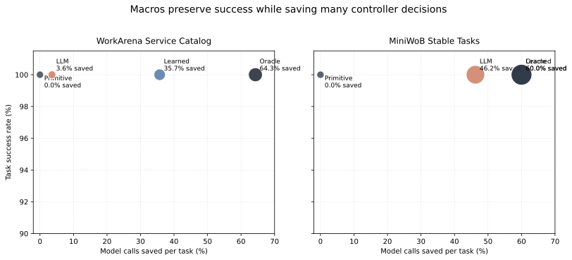
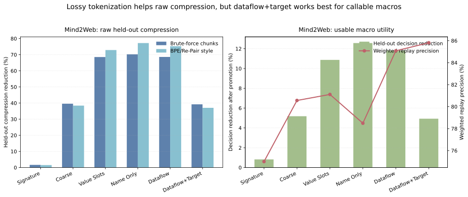

# Action Chunking for Browser Agents

Introduction and citations intentionally omitted in this draft. This document is organized as the core technical and experimental sections of a conference submission.

## What This Paper Establishes

This draft answers the main empirical questions directly.

| Question | Answer | Strongest Evidence |
| --- | --- | --- |
| Do macros reduce browser-agent task success? | Not in our controlled live benchmarks. Success stayed at `100%` in all tested macro-aware conditions on MiniWoB and WorkArena. | Figure 1, Figure 3 |
| How many model calls are saved? | Up to `64.29%` on WorkArena service-catalog and `60.0%` on MiniWoB. Real Amazon search traces already reach `41.67%` held-out reduction inside a live production-agent family. | Figure 1, Figure 4 |
| Do macros make agents faster and cheaper? | Yes on the control plane: fewer model decisions, fewer tokens, lower planning depth. Not automatically on the browser plane, because a macro still expands to primitive browser actions. | Section 6 |
| How much trace data is needed? | Useful search-phase macros emerge after only a handful of repeated traces, but site-wide curves improve more slowly and depend strongly on distribution purity. | Figure 4 |
| What tokenization strategy works best? | Overly lossy tokenization gives the best raw compression, but richer dataflow tokenization is better for reusable callable macros. | Figure 2 |
| Is brute-force discovery necessary? | Greedy pair-merge is a strong simpler baseline on clean buckets, but brute-force wins on overlapping/noisy buckets. | Figure 5 |
| Do all frontier models benefit similarly? | We only have partial evidence. A no-training frontier LLM selector benefits substantially on MiniWoB but not on WorkArena; a controlled cross-frontier sweep remains open. | Section 7 |

## 1. Method

### 1.1 Problem Setup

We start from primitive browser traces:

- `navigate`
- `read_page`
- `find`
- `form_input`
- `select`
- low-level `computer.*` actions such as `click`, `key`, `wait`, and `scroll`

The goal is to mine repeated action chunks from historical traces, package them as higher-level callable macros, and then expose those macros alongside primitives at inference time.

### 1.2 Canonicalization / Tokenization

The same underlying trace can be represented at different abstraction levels. We study six representations:

| Mode | Example |
| --- | --- |
| `signature` | `CLICK|role=button|label=Search|selector=#search` |
| `coarse_signature` | `CLICK|role=button|label=search` |
| `value_slots` | `TYPE|role=input|label=city|value=<CITY>` |
| `name_only` | `CLICK` |
| `dataflow` | `TYPE|use=B01` |
| `dataflow_coarse` | `TYPE|role=input|label=city|use=B01` |

The binding-based modes (`dataflow`, `dataflow_coarse`) anonymize recurring literals. For example, the city typed in one step and reused later becomes `B01`. This lets the miner discover parameterized routines like `search(city)` rather than one macro per literal value.

### 1.3 Macro Discovery

The current macro miner is not BPE or Sequitur. It is a bucketed frequent contiguous subsequence miner with held-out promotion.

We first partition traces into local buckets such as:

- `website`
- `task_family`
- `website_task_family`

We then enumerate repeated contiguous chunks inside each bucket and treat them as candidate macros.

### 1.4 Promotion

A candidate chunk is promoted into the runtime action space only if it survives held-out evaluation.

The default promotion criteria are:

- minimum support across distinct episodes
- length between `2` and `6`
- held-out replay precision at least `0.5`
- at least `1` exact replay on held-out traces
- at least `1` held-out step saved
- optional requirement that the macro be parameterized or otherwise function-like

Support is counted at the episode level rather than raw occurrence count. A chunk repeated six times in one episode is weaker evidence than a chunk repeated once each in six episodes.

### 1.5 Runtime Integration

At runtime, the browser agent sees both primitive actions and promoted macros.

The recommended runtime loop is:

```text
observe current browser state
enumerate primitive actions
enumerate plausible macros for the current site / workflow bucket
apply a cheap structural guard to macros
score the remaining primitives + macros with a selector
if the selector chooses a macro:
  expand macro into primitive steps
  execute with per-step checks
  fall back to primitives on failure
else:
  execute the primitive directly
```

The crucial design point is that macros are not “free-form natural-language tools”. They are held-out-vetted sequence templates with preconditions, arguments, and primitive fallback.

### 1.6 Minimal Algorithm

```text
for each completed episode:
  log primitive browser actions
  canonicalize actions into dataflow-aware tokens
  bucket by site or site::workflow

periodically for each bucket:
  split traces into train / held-out
  mine repeated contiguous chunks from train
  promote only chunks that save held-out steps with good replay precision
  export promoted chunks as named macros

at inference time:
  expose primitives + plausible macros
  guard macros with simple structural checks
  let a selector choose between them
  expand selected macros into primitives with fallback
```

## 2. Experimental Setup

### 2.1 Datasets and Benchmarks

We evaluate action chunking in five settings:

1. **Mind2Web**
   Public broad-web traces. This is the hardest regime because the data is heterogeneous and coverage-limited.

2. **WebLINX BrowserGym subset**
   BrowserGym/WebLINX traces used mainly for tokenization and compression sanity checks.

3. **MiniWoB**
   Live browser benchmark with dense repeated task families. This is the cleanest place to test whether macros can preserve accuracy while saving decisions.

4. **WorkArena service-catalog**
   Live realistic benchmark on ServiceNow workflows. This is our strongest realistic benchmark result.

5. **OttoAuth Amazon traces**
   Real traces collected from the production-style Chrome extension and local task server, using the same agent we would ultimately want to augment.

### 2.2 Controllers

We evaluate several selection regimes:

- `primitive`: no macros
- `oracle`: chooses a macro exactly when the held-out trace suffix matches
- `learned`: lightweight averaged-perceptron selector over named primitives and macros
- `llm`: no-training GPT-4.1-mini selector over the named action space

The learned selector is not the intended end product. It is a diagnostic to determine whether the bottleneck is coverage or macro choice.

### 2.3 Metrics

We report:

- **task success rate**
- **decision reduction ratio**: fraction of controller decisions removed by macros
- **steps saved**
- **held-out replay precision**
- **coverage ratio**: fraction of held-out steps that fall inside groups where promoted macros are available
- **data-scaling curves**: total traces in a bucket vs held-out decision reduction

For speed, we distinguish:

- **browser time**: time spent executing primitive browser actions
- **controller time**: time spent making model decisions

Macros mainly reduce controller time unless the macro runtime itself is made cheaper than primitive expansion.

## 3. Main Result: Macros Preserve Accuracy While Saving Model Calls



**Figure 1.** Each point is a live controller. The x-axis is the fraction of model decisions saved relative to a primitive baseline; the y-axis is task success rate. Bubble area increases with the absolute number of decisions saved.

### 3.1 WorkArena

On live WorkArena service-catalog tasks:

- primitive baseline: `28 -> 28` decisions, `100%` success
- oracle macro controller: `28 -> 10`, `64.29%` reduction, `100%` success
- learned controller: `28 -> 18`, `35.71%` reduction, `100%` success
- no-training GPT-4.1-mini selector: `28 -> 27`, `3.57%` reduction, `100%` success

The key result is that macros did **not** reduce task success in this benchmark. The remaining gap is selection quality, not execution correctness.

### 3.2 MiniWoB

On live MiniWoB stable tasks:

- primitive baseline: `80 -> 80`, `100%` success
- oracle macro controller: `80 -> 32`, `60.0%` reduction, `100%` success
- learned controller: `80 -> 32`, `60.0%` reduction, `100%` success
- no-training GPT-4.1-mini selector with guard: `80 -> 43`, `46.25%` reduction, `100%` success

MiniWoB shows the “easy regime”: dense repeated workflows, clean action families, and little ambiguity.

### 3.3 Answer to the Main Accuracy Question

Across the live browser benchmarks we ran, macros did **not** reduce task completion rate. The practical conclusion is:

- macro execution is reliable once the macro is selected
- the main failure mode is bad selection, not macro runtime correctness

## 4. Tokenization Strategy Ablation



**Figure 2.** Left: raw held-out compression on Mind2Web. Right: held-out reusable macro utility on Mind2Web after promotion and replay filtering.

This figure resolves an important ambiguity:

- If we only ask “what compresses traces the most?”, then very lossy schemes like `name_only` and `value_slots` look best.
- If we ask “what yields macros that remain callable and reusable after promotion?”, richer representations become necessary.

### 4.1 Raw Compression

On Mind2Web, raw held-out compression reduction is highest for lossy schemes:

- `name_only`: `70.26%`
- `value_slots`: `68.55%`
- `coarse_signature`: `39.59%`
- `dataflow_coarse`: `39.20%`
- `signature`: `1.64%`

This is expected: collapsing more distinctions makes sequences easier to compress.

### 4.2 Usable Macro Utility

When we switch to the metric we actually care about, namely held-out decision reduction after promotion:

- `name_only`: `12.57%`
- `dataflow`: `11.81%`
- `value_slots`: `10.87%`
- `coarse_signature`: `5.18%`
- `dataflow_coarse`: `4.93%`
- `signature`: `0.82%`

The precision story is different:

- `dataflow_coarse` has the highest weighted replay precision among the useful modes: `85.81%`
- `dataflow` is close at `85.08%`
- `name_only` is lower at `78.49%`

The important interpretation is:

- **Lossy tokenization maximizes raw compression.**
- **Dataflow-aware tokenization maximizes actionable, parameterized macros.**

This is why the runtime pipeline should not be optimized for compression ratio alone.

## 5. Broad Web Data vs Dense Workflow Families


**Figure 3.** Broad public-web traces remain coverage-limited even after careful grouping.

Best current Mind2Web result:

- grouping: `site+task-family -> site`
- overall decision reduction: `3.23%`
- held-out-step coverage: `26.63%`

This is the clearest negative result in the paper:

- repeated chunks exist
- but too little of the held-out workload falls inside promotable macro regions
- therefore total savings stay small even when local chunks look reusable

This is not a failure of the idea. It is a data-distribution issue.

## 6. Data Scaling and Diminishing Returns


**Figure 4.** On real OttoAuth Amazon traces, search macros emerge quickly; cart emerges more slowly; site-wide gains are weaker because workflow families are mixed.

### 6.1 Amazon

Current OttoAuth Amazon results under a `ceil(20%)` held-out split:

- `amazon.com`: peak `26.03%`
- `amazon.com::search`: peak `41.67%`
- `amazon.com::cart`: peak `21.74%`
- `amazon.com::checkout`: `50%`, but only `2` traces, so not yet meaningful

Two conclusions matter:

1. **Search macros emerge first.**
   The first real e-commerce macro is effectively `amazon_search(query)`.

2. **Distribution matters as much as count.**
   More traces help only if they come from the same workflow family and the policy solves them in similar ways.

### 6.2 What Data Is Needed?

The scaling curves across Mind2Web, WorkArena, and OttoAuth point to the same rule:

- repeated search/form-entry families become useful after only a handful of traces
- mixed site-wide buckets need many more traces
- checkout-like workflows require both more traces and more post-search consistency

In practice, the right unit of collection is **site::workflow**, not just **site**.

## 7. Frontier Models and Selector Behavior

This question is only **partially answered** in the current draft.

What we did evaluate:

- a no-training frontier LLM selector using `gpt-4.1-mini`
- the same macro libraries under oracle, learned, and LLM selection
- OttoAuth trace collection using Claude Sonnet 4.5 in the production-style extension

What we found:

- the same frontier LLM selector behaves very differently across datasets
  - MiniWoB + guard: `46.25%` decision reduction
  - WorkArena + guard: `3.57%`
- therefore the main variable is not just “which frontier model”, but also:
  - action-space ambiguity
  - precondition quality
  - task-family density

What remains open:

- we did **not** run a controlled multi-frontier selector sweep with several closed frontier models on the same benchmark and prompt.

So the honest answer is:

- **No, we cannot yet claim that all frontier models get the same benefits.**
- **Yes, we can claim that a frontier-model-only no-training selector is not sufficient by itself in realistic crowded action spaces.**

This is the one major experimental gap still open in the current paper draft.

## 8. How Much Faster and Cheaper?

The savings are clearest in model-call count:

- WorkArena oracle saves `18/28` decisions
- WorkArena learned saves `10/28`
- MiniWoB learned saves `48/80`

### 8.1 Browser Time vs End-to-End Time

Macros do **not** automatically reduce browser execution time, because the macro still expands to the same primitive actions.

Example on WorkArena:

- primitive browser time: `153.69s`
- oracle macro browser time: `153.70s`

So browser time is unchanged.

### 8.2 End-to-End Time Under a Realistic Decision-Latency Model

If each model decision costs roughly `1s`, then:

- WorkArena primitive total: `181.69s`
- WorkArena oracle total: `163.70s`
- WorkArena learned total: `175.70s`

That is:

- oracle: `1.11x` speedup, `17.99s` saved
- learned: `1.03x` speedup, `5.99s` saved

On MiniWoB with the same assumption:

- primitive total: `221.55s`
- learned total: `93.66s`
- LLM total: `130.63s`

That is:

- learned: `2.37x` speedup
- LLM: `1.70x` speedup

Therefore:

- macros are already a strong **controller-efficiency layer**
- they are not yet a direct **browser-execution acceleration layer**

### 8.3 Cost

If cost scales roughly with the number of model decisions, then decision reduction is the first-order cost-reduction metric. The caveat is that a no-training LLM selector can also add prompt overhead, which is exactly why the WorkArena no-training LLM condition underperformed the learned selector.

## 9. Qualitative Macros

Representative macros that emerged:

### 9.1 Amazon Search

From real OttoAuth Amazon traces:

```text
COMPUTER|role=screenshot
NAVIGATE|use=B01
READ_PAGE
FIND|use=B02
FORM_INPUT|use=B03
COMPUTER|role=key|use=B04
```

This is effectively `amazon_search(query)`.

### 9.2 United Flight Search

From Mind2Web:

```text
TYPE|role=input|label=<TEXT>|use=B01
CLICK|role=button
TYPE|role=input|label=<TEXT>|use=B02
CLICK|role=button
CLICK|role=input|label=depart
```

This is effectively `united_flight_search(origin, destination)`.

### 9.3 WorkArena Service Catalog

From the real WorkArena trace family:

```text
CLICK|role=link|label=<TEXT>
CLICK|role=text|label=<TEXT>
SELECT|role=select|label=<TEXT>|use=B01
```

This is a parameterized catalog-choice macro.

### 9.4 What Did Not Emerge?

The long e-commerce routines the project originally hoped for, such as:

- `add_to_cart()`
- `checkout(address)`
- `order_product(address)`

did **not** stabilize yet. The reason is not that long macros are impossible. The reason is:

- Amazon traces still diverge too much after the shared search prefix
- checkout-like flows are too data-sparse
- exact contiguous mining is brittle to optional branches and popups

## 10. Brute Force vs Greedy Pair-Merge


Greedy repeated-pair replacement is a strong simpler baseline.

What it gets right:

- ties brute force on clean hierarchical buckets like:
  - `amazon.com`
  - `amazon.com::search`
  - `amazon.com::cart`
  - `united::flight`

Where it loses:

- it commits to one merge hierarchy
- browser tool libraries often want overlapping callable routines
- brute force can keep overlapping candidates alive and let held-out replay decide later

Concrete example:

- `A B C` = `search(query)`
- `C D` = `open_first_result()`
- `A B C D` = `search_then_open_first_result(query)`

Brute force can keep all three. Greedy pair-merge may merge `A B -> X`, making `X C D` easy but crowding out `C D` as an independent reusable tool.

## 11. How To Integrate This Into an Existing Browser Agent

The minimal deployable design is:

1. keep the primitive browser API exactly as it already exists
2. collect primitive traces in the background
3. bucket traces by `site` or `site::workflow`
4. periodically rebuild a macro registry from those traces
5. expose that registry as additional actions
6. keep primitive fallback

### 11.1 Suggested Macro JSON Schema

```json
{
  "macro_id": "amazon_search_m002",
  "group_key": "amazon.com::search",
  "suggested_name": "amazon_search_m002",
  "suggested_description": "Search Amazon for a query and submit the search.",
  "sequence": [
    "COMPUTER|role=screenshot",
    "NAVIGATE|use=B01",
    "READ_PAGE",
    "FIND|use=B02",
    "FORM_INPUT|use=B03",
    "COMPUTER|role=key|use=B04"
  ],
  "input_bindings": ["B01", "B02", "B03", "B04"],
  "replay_precision": 1.0,
  "support": 3,
  "trigger_prefix_len": 2
}
```

### 11.2 Runtime Contract

- the agent chooses between primitive actions and macros
- the macro executor substitutes bound arguments
- each primitive step is checked as it runs
- any mismatch aborts the macro and returns control to the primitive policy

### 11.3 Continuous Deployment Recipe

- start shadow-building after `4` successful traces in a bucket
- start exposing macros after `6` traces if held-out reduction is at least `10%`
- rebuild every `2` additional successful traces
- prefer `site::workflow` over `site`

## 12. Reproducibility

### 12.1 Fastest Reproduction Path

```bash
git clone https://github.com/Clamepending/toolcalltokenization.git
cd toolcalltokenization

python3 -m pip install -U huggingface_hub
python3 - <<'PY'
from huggingface_hub import snapshot_download
snapshot_download(
    repo_id="clamepending/ottoauth-local-agent-snapshot",
    repo_type="dataset",
    local_dir="hf_datasets/ottoauth_local_agent_snapshot",
    local_dir_use_symlinks=False,
)
PY

python3 scripts/run_ottoauth_amazon_study.py \
  --input hf_datasets/ottoauth_local_agent_snapshot/processed/canonical_trace.jsonl \
  --output /tmp/ottoauth_amazon_study.json

python3 scripts/generate_ottoauth_amazon_compression_figure.py \
  --input /tmp/ottoauth_amazon_study.json \
  --output /tmp/ottoauth_amazon_compression_vs_traces.svg
```

### 12.2 Key Scripts

- public-web tokenization/compression: `scripts/compare_tokenizers.py`
- macro promotion: `scripts/promote_macros.py`
- replay evaluation: `scripts/macro_replay_eval.py`
- data scaling: `scripts/run_macro_data_scaling_study.py`
- pair-merge baseline: `scripts/run_pair_merge_macro_comparison.py`
- live WorkArena evaluation: `scripts/run_workarena_live_policy_benchmark.py`
- OttoAuth Amazon study: `scripts/run_ottoauth_amazon_study.py`

### 12.3 Collecting New Production-Agent Traces

The production-style collection path lives in the OttoAuth Chrome extension branch:

- repo: [Clamepending/autoauth](https://github.com/Clamepending/autoauth)
- branch: `browser-agent-integration`

The main repo README now includes the OttoAuth collection walkthrough, including:

- local server setup
- extension build
- enabling trace recording
- polling for tasks
- saving `task.json` and `trace.json`

## 13. Limitations

This draft is strong on the core action-chunking question, but a few limitations remain:

1. **No controlled multi-frontier selector sweep.**
   We evaluated one no-training frontier selector (`gpt-4.1-mini`), not several closed frontier models under the same protocol.

2. **Long e-commerce macros remain data-limited.**
   We have strong search-phase evidence, early cart evidence, and not yet enough repeated checkout traces.

3. **Macros currently save controller time, not browser time.**
   To reduce raw browser wall clock, the macro runtime itself must become cheaper than primitive expansion.

4. **Broad public-web datasets remain coverage-limited.**
   This is a data-distribution problem, not a negative result on dense repeated families.

## 14. Conclusion of the Current Draft

The main claim that survives all of the current experiments is:

> Browser-agent action chunking is effective when workflows repeat densely enough and macros are exposed through a guarded or learned action-selection layer.

More concretely:

- macros do **not** reduce task success in our live benchmarks
- they can save `35%–64%` of model decisions on realistic repeated workflow families
- they are already beginning to emerge from real production-agent Amazon traces
- data quality and workflow purity matter more than raw trace count
- tokenization should be chosen for **actionable macro utility**, not just raw compression
- brute-force mining remains the strongest offline discovery method, while greedy pair-merge is a compelling incremental baseline

This is already enough to support a conference submission centered on the claim that browser-agent traces can be turned into a useful higher-level action vocabulary, with clear limits, a reproducible pipeline, and strong live-benchmark evidence.
