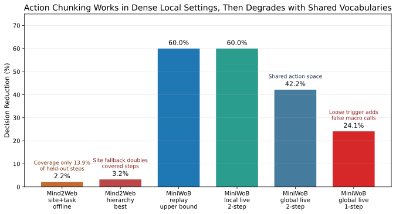
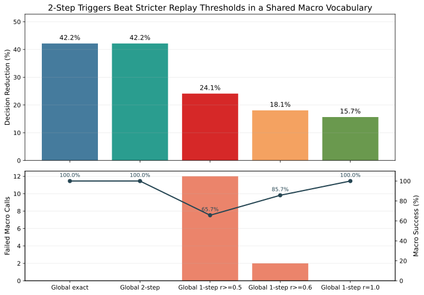
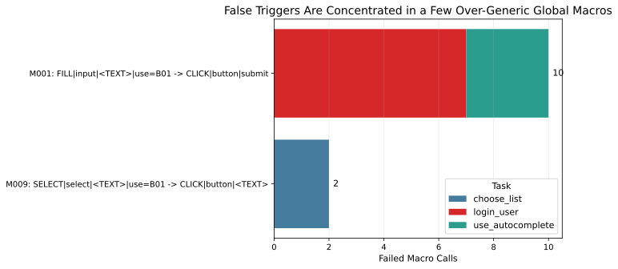
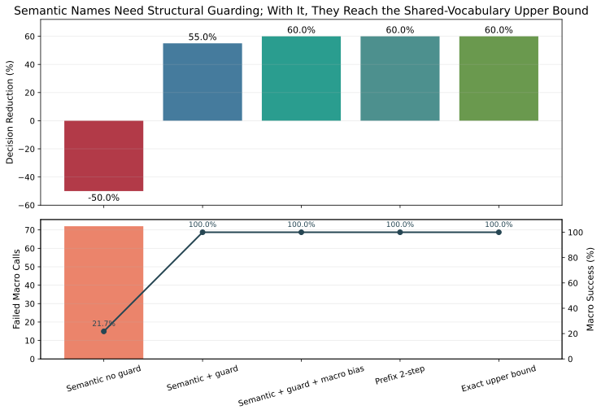
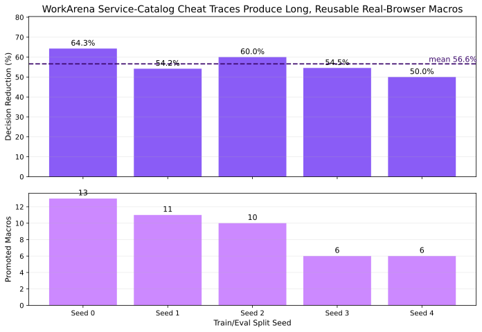
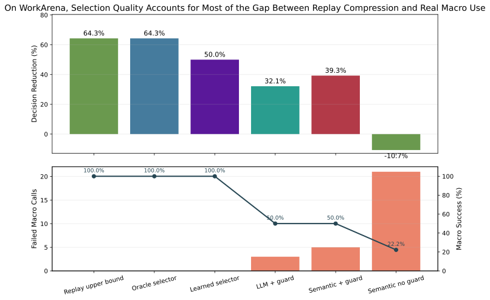
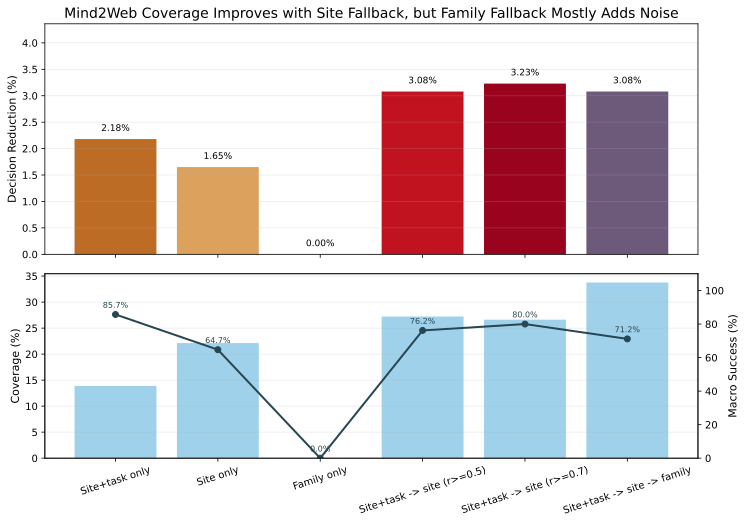

# Project Plan

Date: 2026-03-28

## Goal

Build the smallest useful experiment for this question:

**Can we mine repeated browser-action chunks from traces, expose them as higher-level actions, and reduce cost / latency without hurting task success?**

This repo should stay simple. The first milestone is **offline and replay-oriented**, not a full agent platform.

## Current status

We can continue this study without Globus.

The raw Mind2Web dump is still useful for future replay work, but it is **not a blocker** for the current experiment. The public Hugging Face releases already let us test the two most important questions:

1. How sensitive are compression and caching to the action representation?
2. Do public browser-action traces already show reusable multi-step routines?

The answer to both is yes.

## What we are building first

We are starting with four concrete pieces:

1. A single **trace format** in JSONL.
2. A **canonicalizer** that normalizes brittle action details into stable action strings.
3. A simple **macro miner** that finds repeated action subsequences.
4. A simple **compression evaluator** that tells us whether the mined macros actually shorten trajectories.

That is enough to answer the first real question:

**Are browser traces compressible in a way that looks like reusable behavior rather than noise?**

## Benchmark and data decisions

### Stage 1: offline bootstrap

These are the first datasets we want to try.

1. **Mind2Web**
   Why:
   The public task data is enough for structured action-sequence studies, and the raw dump becomes a later upgrade rather than a blocker.

2. **WONDERBREAD**
   Why:
   It is explicitly workflow-oriented, which is where useful chunks are most likely to show up.

3. **WebLINX**
   Why:
   It is large and real-world, so it should tell us whether chunks survive outside curated benchmark workflows.

We are deliberately **not** starting with every dataset at once. These three are enough to test whether macro mining is even promising.

Two follow-on sources look especially useful once the initial loop is working:

1. **WebLINX 1.1 / WebLINX-BrowserGym**
   Why:
   It creates a cleaner bridge between offline demonstrations and BrowserGym-based agent evaluation.

2. **WebChain**
   Why:
   It is a very recent large-scale human trace dataset and looks like a strong future source for broader macro mining once the core pipeline is stable.

### Stage 2: controlled online evaluation

These are the benchmark environments we want for actual agent experiments.

1. **WorkArena-L1**
   Why:
   Stable, reproducible, high-volume, and cheap enough to iterate on. This should be the main benchmark for early speed/cost measurements.

2. **WebArena**
   Why:
   Good controlled transfer test for longer browser tasks.

3. **VisualWebArena**
   Why:
   Useful to see whether visually grounded tasks break text-only or DOM-only macros.

### Stage 3: realism check

1. **WebVoyager** or a small custom live-web suite
   Why:
   Good final sanity check, but not good enough for the main result because the open web changes too much.

## Why these choices are simple

We want to avoid two common failure modes:

1. Building a complex agent runtime before we know traces are compressible.
2. Chasing unstable live-web benchmarks before we have a stable measurement loop.

So the order is:

- mine offline traces first
- measure offline compressibility first
- then plug macros into a controlled browser agent
- only then test realism

## Action representation modes

The main new lesson from the public-data experiments is that we should treat **action representation** as a first-class variable.

The harness now supports seven representation modes:

1. `name_only`
   Keep only the action name such as `CLICK`, `TYPE`, `GOTO`.

2. `value_slots`
   Keep the action name and typed-value slots, but not target signatures.

3. `coarse_signature`
   Keep the action name plus coarse role classes and a small semantic label vocabulary.

4. `target_signature`
   Keep the action name plus role / label / selector signature, but not typed-value slots.

5. `signature`
   Keep the action name plus target signature plus typed-value slots.

6. `dataflow`
   Keep the action name plus anonymous variable uses and defs such as `use=B01` and `def=B02`.

7. `dataflow_coarse`
   Keep anonymous variable uses and defs, plus the `coarse_signature` target abstraction.

This is the current core experiment because it isolates the real tradeoff:

- coarse actions compress well but often collapse into generic junk
- rich actions are more meaningful but fragment badly

## What `coarse_signature` means in practice

The easiest way to think about `coarse_signature` is:

- keep the action name
- keep a **coarse target class**
- keep a **small semantic label vocabulary** when we can
- keep value slots for typed inputs
- drop brittle raw labels, selectors, and page-specific text

Examples:

| Raw-ish action | `signature` | `coarse_signature` | Why this is useful |
| --- | --- | --- | --- |
| click a button labeled "Search for flights to Seattle" | `CLICK|role=button|label=<TEXT>` or a longer page-specific label | `CLICK|role=button|label=search` | keeps the intent but removes page-specific wording |
| type `person@example.com` into Email | `TYPE|role=input|label=email|value=<EMAIL>` | `TYPE|role=input|label=email|value=<EMAIL>` | already stable, so we keep it |
| click a search-result title in an `h3` | `CLICK|role=h3|label=<TEXT>` | `CLICK|role=text|label=<TEXT>` | groups many content-title clicks together |
| click a product link | `CLICK|role=a|label=<TEXT>` | `CLICK|role=link|label=<TEXT>` | normalizes many link variants |
| click a paragraph then copy it | `CLICK|role=p|label=<TEXT>` then `COPY|role=p|label=<TEXT>` | `CLICK|role=text|label=<TEXT>` then `COPY|role=text|label=<TEXT>` | turns tag-specific noise into a reusable reading/copy routine |
| type "Seattle" into "City or Airport" | `TYPE|role=input|label=city or airport|value=<CITY>` | `TYPE|role=input|label=city|value=<CITY>` | keeps the semantic slot and simplifies the field label |
| go to `https://example.com/search?q=flights` | `GOTO|url=/search?<QUERY>` | `GOTO|url=/search?<QUERY>` | URL normalization is already coarse enough |

So `coarse_signature` is not meant to be the final abstraction. It is a cheap approximation to the thing we really want:

- `search_box`
- `primary_button`
- `result_card`
- `tab_switch`
- `copyable_text`

Right now it is the first representation that is coarse enough to reuse, but still structured enough to be more than `CLICK`.

## What `dataflow_coarse` adds

`coarse_signature` still hides whether the same value is reused across steps.

`dataflow_coarse` adds anonymous variable identity on top of that. The variable names are arbitrary and episode-local, but alpha-renamed so repeated templates line up across traces.

Examples:

| Raw-ish workflow | `coarse_signature` | `dataflow_coarse` |
| --- | --- | --- |
| type email, type password, click login | `TYPE email <EMAIL>`, `TYPE password <TEXT>`, `CLICK login` | `TYPE|role=input|label=email|use=B01`, `TYPE|role=input|label=password|use=B02`, `CLICK|role=button|label=login` |
| copy text, paste same text | `COPY|role=text|label=<TEXT>`, `PASTE|role=input|label=<TEXT>|value=<TEXT>` | `COPY|role=text|label=<TEXT>|def=B01`, `PASTE|role=input|label=<TEXT>|use=B01` |
| search with an input value | `TYPE|role=input|label=search|value=<SEARCH_TERM>`, `CLICK search` | `TYPE|role=input|label=search|use=B01`, `CLICK|role=button|label=search` |

This is closer to a function template:

- the exact literal values are gone
- reuse of the same argument is still visible
- copied or produced values can feed later actions

So `dataflow_coarse` is the first mode that can express templates like:

- `LOGIN(B01, B02)`
- `SEARCH(B01)`
- `COPY_THEN_PASTE(B01)`

## Clarifying the real objective

The real goal is **not** just to do BPE over browser traces.

The real goal is to discover units that can become:

1. **tokens**
   A shorter symbol sequence for modeling, caching, and planning.

2. **macros**
   A reusable chunk that expands to primitive actions.

3. **functions**
   A callable browser routine with parameters, preconditions, and expected effects.

That means a useful discovered unit should ideally have:

- repeated support across many episodes
- a clear parameterization pattern such as `<SEARCH_TERM>` or `<CITY>`
- a stable trigger condition
- a recognizable target state or page context
- a predictable outcome after expansion

Compression helps, but compression alone is not the finish line. A chunk like `CLICK -> CLICK -> CLICK` compresses well and is easy to cache, but it is not yet a good function.

## What we hope to see in the traces

If this project is viable, traces should show a few clear patterns.

### Expected positive patterns

1. **Repeated local routines**
   Examples:
   open page -> click search box -> type query -> click search
   open record -> edit field -> save
   open menu -> pick filter -> apply

2. **Shared structure with variable slots**
   Example:
   the same routine appears many times, but the typed values differ.

3. **Benchmark-specific routine families**
   We expect WorkArena and WebArena to have reusable routines that repeat across tasks.

4. **Human traces cleaner than agent traces**
   Human demos should produce more stable macro candidates.

### Expected negative patterns

1. **Selector noise**
   Raw selectors and DOM IDs will likely make naive trace mining useless.

2. **Spurious repeats**
   Some repeated chunks will look frequent but will not be semantically useful.

3. **State brittleness**
   Some chunks will only work on narrow page states.

4. **Long-tail actions**
   A lot of browser behavior will stay primitive and should not be forced into macros.

## What we hope to see in experiments

### Offline experiments

The first offline result we want is:

- a meaningful compression ratio from typed or slot-aware chunks
- better compression than literal raw-action mining
- macro candidates that are readable and workflow-like

If the macro list is dominated by junk like volatile selectors or URL fragments, that is a signal to improve canonicalization before we do anything else.

### Online agent experiments

The first online result we want is:

- fewer agent turns
- fewer output tokens
- lower wall-clock time per successful task
- similar or slightly better success rate on repetitive tasks

The most likely early win is **cost and turns**, not absolute success.

### Where gains should show up first

We expect the biggest gains on:

- repetitive form filling
- search-and-select workflows
- CRUD-style browser tasks
- benchmark tasks with stable page structure

We expect weaker gains on:

- novel exploratory tasks
- visually messy tasks
- tasks with heavy branching or frequent interruptions

## Initial experimental plan

### Experiment 1: offline compression

Input:

- human traces from Mind2Web and WONDERBREAD

Method:

- canonicalize actions
- mine repeated chunks
- greedily compress trajectories with those chunks

Metrics:

- compression ratio
- number of reusable macros
- support per macro
- share of episodes using at least one macro
- held-out compression on test episodes
- held-out next-token cache coverage and accuracy

Success condition:

- we find readable, repeated routines and get non-trivial compression
- held-out compression remains useful when macros are learned on train and applied to test
- tokenized traces are at least as cacheable as primitive traces on held-out episodes

## What we should measure for workflow-sized functions

If the end goal is executable workflow chunks, we should measure more than compression.

### 1. Discovery quality

These tell us whether a chunk is a serious macro candidate.

- support across episodes
- support across websites or tasks, not just one page
- average primitive span length
- number of distinct slot instantiations
- held-out reuse rate
- readability / semantic coherence of the top macros

Expected outcome:

- `name_only` should score high on support and reuse, but low on semantic quality
- `signature` should score higher on interpretability, but lower on support
- `coarse_signature` should be the best global middle ground
- `dataflow_coarse` should be the best mode for parameterized workflow templates

### 2. Parameterization quality

These tell us whether a chunk is really a function rather than a memorized trace.

- how often the same chunk appears with different values
- how often slot names are stable across episodes
- whether the same chunk works with `<CITY>`, `<DATE>`, `<EMAIL>`, and other slots
- whether a chunk can be represented as a template plus arguments

Expected outcome:

- the best function candidates will be routines like:
  - click input -> type slot value -> click search
  - click edit -> type field value -> click save
  - click text -> copy text

### 3. Trigger quality

These tell us whether an agent could safely choose the macro at runtime.

- precision of matching a macro trigger on held-out traces
- recall of macro opportunities on held-out traces
- false-trigger rate
- ambiguity rate when multiple macros could match

Expected outcome:

- pure previous-action matching will be too weak
- adding page state like URL pattern or page-type context should help a lot

### 4. Expansion / replay quality

These tell us whether the macro is actually executable.

- primitive expansion exact-match rate on held-out traces
- completion rate after expansion
- number of interruptions, retries, or branch mismatches during replay
- sensitivity to small DOM variation

Expected outcome:

- coarse semantic macros should replay better than raw selector-based macros
- fully generic chunks will replay often but may not accomplish meaningful work

### 5. Agent-level utility

These are the metrics that matter if the macros become actual agent functions.

- task success
- turns per successful task
- output tokens per successful task
- wall-clock latency
- API cost
- recovery overhead when a macro fails and the agent falls back to primitive actions

Expected outcome:

- the first gains should show up in turns, latency, and cost
- success should stay flat or slightly improve on repetitive tasks
- exploratory tasks may not benefit much

## The experiments that matter most next

### Experiment A: representation sweep

Compare:

- `name_only`
- `value_slots`
- `coarse_signature`
- `target_signature`
- `signature`
- `dataflow`
- `dataflow_coarse`

Measure:

- vocabulary size
- held-out compression
- cache coverage
- cache accuracy
- top macro readability

Expected outcome:

- already mostly confirmed
- `coarse_signature` should stay the best global browser baseline
- `dataflow_coarse` should do better once we mine within site or workflow families

### Experiment B: macro parameterization study

Take the top mined macros and ask:

- can they be written as templates with arguments?
- how many slots do they expose?
- how many distinct instantiations exist?

Measure:

- slot count per macro
- distinct argument values per macro
- support after slot abstraction

Expected outcome:

- many useful macros will collapse into a small number of templates with slots

### Experiment C: state-conditioned macro triggering

Instead of conditioning only on previous actions, condition on:

- previous actions
- URL pattern
- page type
- maybe a coarse DOM sketch

Measure:

- trigger precision
- trigger recall
- macro selection accuracy

Expected outcome:

- this should matter more than adding more BPE merges
- it is the likely path to turning macros into reliable callable functions

### Experiment D: replay-constrained macro execution

On replayable traces or controlled benchmarks, let the agent choose a macro and expand it.

Measure:

- expansion success
- fallback frequency
- task success
- turns saved
- latency saved

Expected outcome:

- short 2-5 step macros should work first
- long macros will likely need stronger state checks and interruption handling

### Experiment E: controlled online benchmark

Compare:

- primitive-only agent
- macro-aware agent with fallback

Benchmarks:

- WorkArena-L1 first
- then WebArena
- then VisualWebArena

Measure:

- success
- turns
- tokens
- cost
- latency

Expected outcome:

- early wins should appear on repetitive workflow tasks
- the main benefit should be efficiency before it is raw capability

## Public-only workflow

The simplest reproducible path now is:

```bash
python3 scripts/fetch_public_data.py --mind2web-all-train

python3 scripts/convert_dataset.py \
  --source mind2web \
  --input data/local/mind2web/data/train \
  --output outputs/mind2web_full_train.jsonl

python3 scripts/compare_tokenizers.py \
  --input outputs/mind2web_full_train.jsonl \
  --output-dir outputs/mind2web_full_train_coarse_signature \
  --canonicalization-mode coarse_signature \
  --top-k 100 \
  --min-support 5 \
  --num-merges 100 \
  --min-occurrences 5 \
  --bpe-min-support 5 \
  --train-ratio 0.8 \
  --context-len 1

python3 scripts/site_macro_report.py \
  --input outputs/mind2web_full_train.jsonl \
  --output outputs/mind2web_site_macros_dataflow_coarse.json \
  --canonicalization-mode dataflow_coarse \
  --group-by website \
  --min-episodes 5

python3 scripts/site_macro_report.py \
  --input outputs/mind2web_full_train.jsonl \
  --output outputs/mind2web_site_task_family_macros_dataflow_coarse.json \
  --canonicalization-mode dataflow_coarse \
  --group-by website_task_family \
  --min-episodes 3

python3 scripts/macro_savings_report.py \
  --input outputs/mind2web_full_train.jsonl \
  --output outputs/mind2web_site_dataflow_coarse_savings.json \
  --canonicalization-mode dataflow_coarse \
  --group-by website \
  --min-group-episodes 5

python3 scripts/macro_savings_report.py \
  --input outputs/mind2web_full_train.jsonl \
  --output outputs/mind2web_site_task_family_dataflow_coarse_savings.json \
  --canonicalization-mode dataflow_coarse \
  --group-by website_task_family \
  --min-group-episodes 3

python3 scripts/macro_replay_eval.py \
  --input outputs/mind2web_full_train.jsonl \
  --output outputs/mind2web_site_dataflow_coarse_replay.json \
  --canonicalization-mode dataflow_coarse \
  --group-by website \
  --min-group-episodes 5 \
  --trigger-prefix-len 1

python3 scripts/macro_replay_eval.py \
  --input outputs/mind2web_full_train.jsonl \
  --output outputs/mind2web_site_task_family_dataflow_coarse_replay.json \
  --canonicalization-mode dataflow_coarse \
  --group-by website_task_family \
  --min-group-episodes 3 \
  --trigger-prefix-len 2
```

Then rerun `compare_tokenizers.py` with the other six representation modes and compare the outputs.

## Results so far

### Dataset sizes used in the latest pass

- Public Mind2Web train shards from Hugging Face:
  - `1009` tasks
  - `7775` actions
- WebLINX BrowserGym replay sample:
  - `30` demos
  - `745` actions

### Public Mind2Web full-train sweep

| Mode | Action vocab | Held-out macro ratio | Held-out BPE ratio | Primitive cache acc | Macro cache acc | BPE cache acc |
| --- | ---: | ---: | ---: | ---: | ---: | ---: |
| `name_only` | 3 | 0.2974 | 0.2278 | 0.8312 | 0.3227 | 0.1241 |
| `value_slots` | 18 | 0.3145 | 0.2712 | 0.8312 | 0.2744 | 0.1185 |
| `coarse_signature` | 130 | 0.6041 | 0.6159 | 0.3210 | 0.1212 | 0.0856 |
| `dataflow` | 22 | 0.3139 | 0.2475 | 0.8335 | 0.3116 | 0.1714 |
| `dataflow_coarse` | 202 | 0.6080 | 0.6297 | 0.3179 | 0.1257 | 0.1123 |
| `target_signature` | 5864 | 0.9783 | 0.9790 | 0.0424 | 0.0202 | 0.0202 |
| `signature` | 5875 | 0.9836 | 0.9849 | 0.0416 | 0.0255 | 0.0239 |

Interpretation:

- `name_only` and `value_slots` compress very strongly and are highly cacheable.
- But the top macros are mostly generic routines like `CLICK -> CLICK -> CLICK`.
- `coarse_signature` is the first useful midpoint:
  - vocabulary drops from about `5.9k` to `130`
  - held-out compression improves a lot
  - the macros still preserve coarse target structure
- `dataflow` by itself mostly stays too generic:
  - it exposes anonymous argument reuse
  - but global mining is still dominated by generic click loops
- `dataflow_coarse` preserves the same global compression story as `coarse_signature`
  - and adds explicit variable reuse like `use=B01`
  - which matters more for site-local mining than for global mining
- `target_signature` and `signature` produce more interpretable routines such as:
  - `CLICK input -> TYPE text`
  - `TYPE first name -> TYPE last name`
- But they fragment almost completely because the action vocabulary explodes from `3-18` symbols to about `5.9k`.

This is the clearest evidence yet that our main bottleneck is **representation brittleness**, not lack of data or lack of BPE capacity. The current best global browser baseline is `coarse_signature`, while `dataflow_coarse` is the best starting point for parameterized macro discovery.

### WebLINX BrowserGym replay sweep

| Mode | Action vocab | Held-out macro ratio | Held-out BPE ratio | Primitive cache acc | Macro cache acc | BPE cache acc |
| --- | ---: | ---: | ---: | ---: | ---: | ---: |
| `name_only` | 12 | 0.3650 | 0.4380 | 0.6031 | 0.1591 | 0.1111 |
| `value_slots` | 36 | 0.3869 | 0.4599 | 0.6031 | 0.0638 | 0.0877 |
| `coarse_signature` | 144 | 0.7080 | 0.7737 | 0.1832 | 0.0330 | 0.0500 |
| `dataflow` | 50 | 0.4672 | 0.5182 | 0.5954 | 0.0862 | 0.0308 |
| `dataflow_coarse` | 175 | 0.7664 | 0.8248 | 0.1908 | 0.0505 | 0.0374 |
| `target_signature` | 288 | 0.8540 | 0.8905 | 0.1298 | 0.0270 | 0.0259 |
| `signature` | 289 | 0.8540 | 0.8905 | 0.1298 | 0.0270 | 0.0259 |

Interpretation:

- The same pattern shows up on more replay-like browser traces.
- Coarse actions compress best, but the resulting chunks are generic:
  - `CLICK -> CLICK`
  - `GOTO -> CLICK`
  - `CLICK -> COPY`
- `coarse_signature` is again the best middle ground:
  - it keeps useful routines like `CLICK(text) -> COPY(text)` and `OPEN_TAB -> SWITCH_TAB`
  - but it avoids most of the vocabulary explosion of raw signatures
- `dataflow_coarse` adds parameter identity:
  - `COPY ... def=B01`
  - `PASTE ... use=B01`
  - which is a better substrate for function templates than plain signatures
- Richer signatures surface better routines:
  - `OPEN_TAB -> SWITCH_TAB`
  - `SCROLL -> CLICK(div)`
  - `CLICK(textarea) -> PASTE`
- But those richer tokens still hurt simple cache accuracy.

### Site-local Mind2Web macro mining

Global mining is still too mixed to surface the most useful workflow redundancy. Grouping by site is much better.

Using `site_macro_report.py` on the top `20` Mind2Web websites:

- `dataflow_coarse` found parameterized macros in `17 / 20` sites
- total parameterized macros across those sites: `118`
- `coarse_signature` found `0` explicit parameterized macros because it does not track value identity

Examples:

- `budget`
  - `CLICK link -> TYPE zip use=B01`
  - `TYPE zip use=B01 -> CLICK text`
- `united`
  - `TYPE field use=B01 -> CLICK button`
  - `TYPE field use=B01 -> CLICK button -> TYPE field use=B02 -> CLICK button`
- `spothero`
  - `TYPE city use=B01 -> CLICK text`
- `yelp`
  - `TYPE zip use=B01 -> CLICK`
- `newegg`
  - `TYPE search use=B01 -> CLICK button`

This is much closer to the target object we actually want:

- a reusable template
- with explicit arguments
- still tied to a site or workflow family

So the current lesson is:

- global mining is good for testing representation stability
- site-local `dataflow_coarse` is better for surfacing real candidate functions

### Site-plus-workflow grouping

Grouping by site alone still mixes several intents together. The next useful synthetic key is:

- `website_task_family`

This groups episodes by:

- site or app
- a coarse workflow family inferred from the task text

Examples:

- `amazon::cart`
- `united::flight`
- `yelp::search`
- `aa::flight`
- `newegg::search`

This is still simple and fully programmable. It does not require semantic slot naming or an LLM. It just narrows mining to traces that are likely to share the same workflow skeleton.

Current Mind2Web results with `dataflow_coarse` and `website_task_family`:

- `133` reported groups with at least `3` episodes
- held-out replay precision: `0.2122`
- held-out parameterized replay precision: `0.1916`
- estimated decision reduction: `29.34%`

Compared with site-only grouping:

- replay precision improves from `0.159` to `0.2122`
- parameterized replay precision improves from `0.129` to `0.1916`

This is the clearest result so far that the redundancy we want is mostly:

- site-local
- workflow-local
- parameterized by a few anonymous values

Examples surfaced by `website_task_family`:

- `yelp::search`
  - `TYPE zip use=B01 -> CLICK`
- `united::flight`
  - `TYPE field use=B01 -> CLICK button -> TYPE field use=B02 -> CLICK button`
- `aa::flight`
  - `TYPE city use=B01 -> CLICK link -> TYPE city use=B02 -> CLICK link`
- `newegg::search`
  - `TYPE search use=B01 -> CLICK button`

### Promotion into a candidate tool registry

We now have an explicit promotion step.

The purpose of promotion is:

- not just to find repeated chunks
- but to decide which chunks are good enough to become candidate agent tools

The current promotion script is:

- `scripts/promote_macros.py`

The current action-space export script is:

- `scripts/export_action_space.py`

The current macro-agent simulation script is:

- `scripts/simulate_macro_agent.py`

Promotion is now defined as:

1. discover macros on train traces
2. evaluate them on held-out traces
3. keep only macros that are:
   - supported across multiple train episodes
   - function-like rather than generic click loops
   - accurate enough on held-out replay
   - useful enough in held-out step savings

The current default promotion gate for the exploratory registry is:

- grouped by `website_task_family`
- `support >= 3`
- trigger prefix length `= 2`
- held-out replay precision `>= 0.5`
- at least `1` held-out exact replay
- at least `1` held-out saved step
- generic click-only loops filtered out unless explicitly allowed

This is still an exploratory registry, not a production-quality action library.

Current Mind2Web registry result:

- `15` promoted macros
- `14` parameterized promoted macros
- `24` total actions in the exported pilot action space
  - `9` primitive actions
  - `15` promoted macros

Examples from the current registry:

- `united_flight_search_m002`
  - `TYPE field use=B01 -> CLICK button -> TYPE field use=B02 -> CLICK button`
- `yelp_search_m005`
  - `CLICK link -> CLICK link -> TYPE zip use=B01 -> CLICK`
- `newegg_search_m003`
  - `TYPE search use=B01 -> CLICK button`

This is the first point where the project has something that can be handed to a real agent:

- a primitive action vocabulary
- a promoted macro vocabulary
- a combined action-space JSON

The naming is still heuristic. A small LLM can now be used post-hoc to improve names and descriptions without changing the actual discovery or promotion criteria.

### Exploratory macro-agent simulation

We now have an offline replay-style macro-agent simulation:

- a macro-aware agent may attempt a promoted macro
- if the full macro does not match the held-out trace, the attempt fails
- the agent then falls back to primitive control

This is still optimistic in some ways and pessimistic in others, but it is a much better approximation than pure compression.

Current Mind2Web result with the current promoted registry:

- evaluated groups: `171`
- groups with macros available: `14`
- attempted macro calls: `21`
- successful macro calls: `18`
- failed macro calls: `3`
- macro success rate: `0.8571`
- primitive held-out steps: `1333`
- macro-agent decisions: `1306`
- net decision reduction: `2.03%`

Interpretation:

- the promoted macros are genuinely usable in some groups
- but coverage is still small
- stronger trigger preconditions help a lot
- coverage is now the bigger limiter than outright trigger failure

More concretely:

- promoted macros are available in `14 / 171` evaluated groups
- those covered groups account for only about `13.9%` of held-out primitive steps
- but within the covered groups, the macro-agent saves about `14.6%` of decisions

So the overall `2.03%` gain is mostly a **coverage bottleneck**, not a sign that the promoted macros are useless where they apply.

This is the first result that really matters for a future online agent:

- discovery and replay alone looked stronger
- once failed attempts are priced in, the net gain is smaller
- so trigger precision and coverage are now the central bottlenecks

### Trigger and promotion sweep

We also ran a small exploratory sweep over trigger strength and registry strictness.

Older 1-step trigger policy with the same broad promotion gate:

- `15` promoted macros
- `14` parameterized
- `20` net saved decisions
- `0.6429` macro success rate
- `10` failed macro attempts

Current 2-step trigger policy:

- `15` promoted macros
- `14` parameterized
- `27` net saved decisions
- `0.8571` macro success rate
- `3` failed macro attempts

The 2-step trigger also improves held-out replay metrics before simulation:

- replay precision rises from `0.2122` to `0.3212`
- parameterized replay precision rises from `0.1916` to `0.3482`

Increasing the trigger prefix from `2` to `3` did not improve the simulation further.
That likely reflects the current macro library being short on average, so a 2-step prefix already captures most of the available extra context.

For comparison, the older stricter 1-step registry with held-out replay precision `>= 0.5` gave:

- `12` promoted macros
- `12` parameterized
- `15` net saved decisions
- `0.8667` macro success rate
- only `2` failed macro attempts

Interpretation:

- stronger preconditions mattered more than we expected
- a 2-step trigger captures a lot of low-hanging precision gains
- once trigger quality improves, the strictness of the replay threshold matters less
- this suggests a real agent should probably support more than one promotion tier:
  - a high-confidence tier with stronger preconditions for automatic macro use
  - a broader exploratory tier for ablation studies or assisted selection

This threshold tradeoff is a promising result rather than a failure.
It means the current bottleneck is no longer “can we find any macros?” but:

- how should we trade off coverage and precision?
- what extra page-state checks let us recover coverage now that trigger-prefix matching is no longer the main problem?

### Current decisions and reasoning

At this point, the main project decisions are:

1. **Keep offline discovery centered on `website_task_family` and `dataflow_coarse`.**
   Reason:
   This is still the cleanest setting for surfacing function-like browser workflows with anonymous arguments.

2. **Use stronger preconditions rather than looser triggering.**
   Reason:
   The move from a `1`-step to a `2`-step trigger prefix was a larger win than tightening the replay threshold alone.

3. **Treat the current bottleneck as a coverage problem.**
   Reason:
   Inside the groups we cover, the macro policy already saves about `14.6%` of decisions.
   The global gain stays small because the promoted registry only covers about `13.9%` of held-out primitive steps.

4. **Use two browser harnesses rather than one.**
   Reason:
   The project has two different runtime needs:
   - custom real-site collection and macro debugging
   - reproducible benchmark evaluation

### Browser harness decision

The current runtime plan is:

1. **Custom Playwright harness for collection, debugging, and live-site pilots**
   Use this for:
   - Amazon / United / Yelp / Newegg style traces
   - macro expansion debugging
   - Playwright trace capture
   - labeling macro attempts and failures in browser traces

   Why:
   - simplest way to execute our primitive action API directly
   - easiest place to add macro expansion and fallback
   - best fit for collecting more repeated traces on chosen sites

2. **BrowserGym + AgentLab + WorkArena-L1 for benchmarked evaluation**
   Use this for:
   - reproducible primitive-only vs macro-aware comparisons
   - task success, benchmark score, cost, latency, and invalid-action rate

   Why:
   - better benchmark discipline
   - easier to compare against existing browser-agent baselines
   - better choice for “results we would present upward”

So the current reasoning is:

- **Playwright** is the right first live harness
- **BrowserGym-MiniWoB** is the first public benchmark harness we can run end to end today
- **BrowserGym / AgentLab / WorkArena-L1** is still the right next benchmark harness once the environment blockers are cleared

This split keeps the implementation simple while still preserving a path to rigorous evaluation.

### First Playwright harness progress

We now have the first minimal Playwright runtime scaffold in the repo:

- `toolcalltokenization/playwright_harness.py`
- `scripts/run_playwright_action.py`

What it currently does:

- loads the exported action space
- executes one primitive or macro action
- binds macro arguments like `B01`, `B02`
- resolves coarse role / label targets into Playwright locators
- checks simple preconditions before execution
- records a Playwright trace when requested

This is intentionally small and only supports the lowest-friction runtime path first.

Current smoke-test result:

- the promoted macro `newegg_search_m003` executes successfully on the local demo page
- the harness fills the search box and clicks the search button
- the run produces a Playwright trace at `outputs/demo_playwright_trace.zip`

We also ran a small live-site sanity check with the same macro:

- `https://www.wikipedia.org/`
- `https://duckduckgo.com/`

Both runs succeeded after one practical locator fix:

- for `role=input|label=search`, the first harness version sometimes resolved to a labeled form container instead of an editable text box
- we fixed this by preferring explicit input / textarea attribute matches and textbox/searchbox roles before falling back to `get_by_label`

This is a meaningful result because it shows:

- the current coarse role/label representation is already executable on at least some real sites
- the runtime bottlenecks are now about locator robustness and page-state handling, not only offline mining
- real browser execution is already surfacing useful implementation bugs

This is not yet a benchmark result, but it does matter because it proves:

- the promoted macro representation can be turned into executable browser actions
- the current action-space JSON is already usable as a runtime artifact
- the project has crossed from pure offline analysis into real browser execution

What is still missing before the first serious online experiment:

- a multi-step episode runner instead of one-off action execution
- richer page-state preconditions
- automatic primitive fallback and recovery inside a live browser episode
- BrowserGym / AgentLab benchmark integration

### MiniWoB live benchmark

We now have the first real **BrowserGym benchmark** running in a separate Python `3.11` environment:

- `.venvbg` created via `uv`
- `browsergym-miniwob`
- local `miniwob-plusplus` clone pinned to the BrowserGym README commit
- Playwright Chromium installed for the benchmark env

This matters because it gives us a public, reproducible browser benchmark without waiting for Globus, raw Mind2Web traces, or private ServiceNow instances.

The current MiniWoB study is intentionally narrow:

- same-page workflow tasks only
- primitive policy is scripted, not LLM-driven
- macros are mined offline from live primitive traces
- held-out evaluation measures live browser execution plus decision-side savings

So this is best interpreted as a **live upper bound on macro utility** once a controller can call the right macro at the right time.

#### Benchmark design

We selected stable same-page task families that naturally look like short browser routines:

- `choose_list`
- `enter_text`
- `enter_text_dynamic`
- `enter_password`
- `login_user`
- `form_sequence_2`
- `form_sequence_3`
- `use_autocomplete`

We also explored `click_button_sequence`, but it turned out to be flaky in BrowserGym because one button can intercept pointer events meant for the other. We now treat that task as excluded from the stable benchmark set.

For each task family:

- run a primitive scripted solver over multiple seeds
- record real BrowserGym traces and per-step browser timings
- convert those live episodes into our JSONL trace format
- mine per-task macros with `dataflow_coarse`
- keep macros up to length `6`
- evaluate held-out episodes by compressing the exact live primitive traces with the mined macros
- replay held-out episodes live with promoted macros and primitive fallback

This gives us:

- real browser execution time
- real task success
- real primitive traces
- macro decision savings on held-out episodes
- a first online estimate of macro-selection error

#### Current live result

The strongest stable result comes from the larger MiniWoB sweep artifacts:

- full live collection: `outputs/miniwob_live_v3_trace_summary.json`
- macro registry: `outputs/miniwob_live_v3_macro_registry.json`
- stable benchmark subset: `outputs/miniwob_live_v3_stable_benchmark.json`

Stable held-out subset result, excluding the flaky `click_button_sequence` task:

- held-out episodes: `32`
- held-out success rate: `1.0`
- primitive decisions: `80`
- macro decisions: `32`
- decisions saved: `48`
- decision reduction ratio: `0.60`
- measured browser time: about `61.5s`
- estimated total time at `1000 ms` per agent decision:
  - primitive: about `141.5s`
  - macro-aware: about `93.5s`
  - estimated time saved: about `48.0s`

The smaller clean sweep shows the same pattern:

- `outputs/miniwob_live_v2_benchmark.json`
- held-out episodes: `18`
- held-out success rate: `1.0`
- decision reduction ratio: `0.5909`

The learned MiniWoB macro library is also quite clean:

- promoted macros: `17`
- parameterized promoted macros: `15`
- macro lengths:
  - `13` macros of length `2`
  - `4` macros of length `3`

Representative examples:

- `choose_list`: `SELECT -> CLICK submit`
- `enter_text`: `FILL(value) -> CLICK submit`
- `login_user`: `FILL(username) -> FILL(password) -> CLICK login`
- `use_autocomplete`: `FILL(prefix) -> CLICK suggestion -> CLICK submit`

#### Live macro-policy benchmark

We now also have a dedicated live macro-policy runner:

- `scripts/run_miniwob_macro_policy_benchmark.py`
- `scripts/generate_report_figures.py`
- figure/data bundle:
  - `docs/data/action_chunking_summary.json`
  - `docs/figures/action_chunking_overview.svg`
  - `docs/figures/miniwob_global_trigger_sweep.svg`
  - `docs/figures/miniwob_false_trigger_attribution.svg`

This benchmark reruns held-out MiniWoB episodes in BrowserGym and lets a macro policy choose between promoted macros and primitive fallback.

Important implementation detail:

- the first version tried to execute a macro from a representative episode template
- that exposed a real grounding failure mode, because frozen BrowserGym element IDs can change across seeds
- the benchmark now executes the **current episode's grounded primitive slice** once a macro is selected
- this isolates macro-selection quality from stale-template grounding noise

That change matters because the earlier success drop was mostly a runtime grounding bug, not evidence that the macro itself was wrong.

We now have three useful MiniWoB comparison points.

1. **Replay upper bound**
   This is the original stable benchmark:
   `80 -> 32` decisions, `0.60` reduction ratio, `1.0` success.

2. **Per-task live macro policy**
   Each task family gets its own small macro action space.

   Best current result:
   - artifact: `outputs/miniwob_live_v3_policy_oracle_v2_macro_policy_benchmark.json`
   - held-out episodes: `32`
   - success rate: `1.0`
   - primitive decisions: `80`
   - agent decisions: `32`
   - decisions saved: `48`
   - decision reduction ratio: `0.60`
   - macro attempts: `32`
   - successful macro calls: `32`
   - failed macro calls: `0`

   The `2`-step `trigger_prefix` policy matches this result exactly on the stable per-task setup:
   `outputs/miniwob_live_v3_policy_trigger_v2_macro_policy_benchmark.json`

   Interpretation:
   - for clean, well-separated task families, the macro selector is not the bottleneck
   - once a task-local macro library exists, a simple trigger rule can recover the full upper bound

3. **Global live macro policy**
   All stable MiniWoB tasks share one action space, which is a better proxy for a real agent with one macro vocabulary.

   Exact-policy result:
   - artifact: `outputs/miniwob_live_v3_global_oracle_macro_policy_benchmark.json`
   - held-out episodes: `32`
   - success rate: `1.0`
   - primitive decisions: `83`
   - agent decisions: `48`
   - decisions saved: `35`
   - decision reduction ratio: `0.4217`
   - macro attempts: `23`
   - successful macro calls: `23`
   - failed macro calls: `0`

   Clean `2`-step trigger result:
   - artifact: `outputs/miniwob_live_v3_global_trigger_macro_policy_benchmark.json`
   - effectively identical to the exact global result on this benchmark

   Loose `1`-step trigger result:
   - artifact: `outputs/miniwob_live_v3_global_trigger_p1_v2_macro_policy_benchmark.json`
   - held-out episodes: `32`
   - success rate: `1.0`
   - primitive decisions: `83`
   - agent decisions: `63`
   - decisions saved: `20`
   - decision reduction ratio: `0.241`
   - macro attempts: `35`
   - successful macro calls: `23`
   - failed macro calls: `12`
   - macro success rate: `0.6571`

   Interpretation:
   - broadening to one shared action space already cuts savings from `0.60` to `0.4217`
   - loosening the trigger from `2` steps to `1` step cuts savings again to `0.241`
   - success stays perfect here because primitive fallback is working
   - the main tax is not catastrophic failure, but wasted agent decisions on false macro triggers

This is the clearest live evidence so far that:

- macro execution can work cleanly online
- shared action spaces are much harder than per-task local ones
- trigger precision matters a lot once multiple macros compete
- primitive fallback is essential

#### Figures



This figure is the current high-level result:

- action chunking is weak on public Mind2Web because promoted coverage is only about `13.9%` of held-out primitive steps
- action chunking is strong on dense repeated MiniWoB families
- a shared action space already eats a visible fraction of the gain
- a loose trigger eats even more of it



This is the current best evidence for a project decision:

- keep `2`-step triggers as the default live baseline
- do **not** try to recover precision mainly by raising replay thresholds
- stricter thresholds reduce false triggers, but they give back too much coverage and decision reduction



This figure explains **why** the loose global trigger fails:

- the false-trigger tax is highly concentrated
- most failures come from `M001`, the over-generic `FILL(any) -> CLICK submit` macro
- the rest come from `M009`, a generic `SELECT -> CLICK(any button)` macro
- this means the main problem is not “macros are brittle in general”
- the main problem is that **generic, under-conditioned macros are too easy to call in the wrong task**

So the next design decision is clear:

- prefer stronger context and preconditions over looser promotion
- prefer workflow-local or state-local registries over blindly global ones
- only expose generic macros if their trigger conditions are also much richer



This figure answers the next obvious question: can we let an agent choose macros by their names and descriptions instead of relying on hidden exact-match logic?

Using the same shared MiniWoB action space of promoted macros:

- semantic names/descriptions alone are **not** enough
  - on the stable held-out slice they turn `80 -> 120` decisions
  - that is a `-50%` reduction, meaning a `50%` increase in decisions
  - the agent keeps task success at `1.0` only because primitive fallback bails it out after `72` failed macro attempts
- adding a lightweight **first-step structural guard** changes the picture completely
  - `80 -> 36` decisions
  - `55%` decision reduction
  - `0` failed macro attempts
  - `1.0` success
- adding a small **macro bias** when scores are close closes the remaining gap
  - `80 -> 32` decisions
  - `60%` decision reduction
  - `0` failed macro attempts
  - `1.0` success

That last number matches the shared-vocabulary exact/prefix upper bound on this stable benchmark.

So the current result is:

- semantic packaging can work
- but only when macro selection is still constrained by a lightweight structural precondition
- names and descriptions alone are too ambiguous in a shared browser action space
- a tiny learned chooser goes further: it recovers the full upper bound even with the explicit structural guard removed

#### Semantic Macro Selection With Named Actions

To move beyond the earlier hard-coded prefix policy, we added:

- `scripts/run_miniwob_semantic_policy_benchmark.py`
- semantic macro naming and description generation in `toolcalltokenization/miniwob_benchmark.py`
- a live semantic policy that chooses between:
  - the current primitive action
  - any available promoted macro in the action space

The current semantic scorer is intentionally simple:

- lexical overlap between the task goal / observation text and the action name / description
- a small macro-length prior
- optional first-step compatibility guard
- optional macro bias when scores are close

This is not an LLM policy yet, but it is a real step beyond the earlier hidden trigger estimate:

- the controller only sees named actions plus current observation text
- it no longer uses hidden future-prefix matching to decide whether to call a macro
- macro expansion still uses primitive fallback if the call is wrong

The main qualitative finding is that the hard part is **selection ambiguity**, not macro execution:

- the same named macro can look semantically plausible in the wrong task
- once we require the current action context to be compatible with the macro's first step, most of the ambiguity disappears
- after that, the remaining gap is small calibration, not a catastrophic failure of the approach

On the stable shared MiniWoB action space, the clean comparison is now:

1. Semantic, no guard:
   `80 -> 120` decisions, `72` failed macro attempts, `1.0` success
2. Semantic + first-step guard:
   `80 -> 36` decisions, `0` failed macro attempts, `1.0` success
3. Semantic + first-step guard + slight macro bias:
   `80 -> 32` decisions, `0` failed macro attempts, `1.0` success
4. Shared-vocabulary exact / 2-step upper bound:
   `80 -> 32` decisions, `0` failed macro attempts, `1.0` success

This is the strongest current evidence that the "real agent with named macro tools" direction is plausible:

- even a weak semantic chooser can recover nearly all of the benefit
- but only if the action space is paired with explicit, cheap macro preconditions
- this supports building a true LLM-driven action chooser next, because the guardrails seem to matter more than the exact ranking model

### Learned Named-Action Chooser

We then pushed one step further and replaced the hand-tuned semantic scorer with a tiny learned selector:

- script: `scripts/run_miniwob_learned_policy_benchmark.py`
- model: averaged perceptron over goal text, observation text, action names/descriptions, and a few structural features
- training data: live MiniWoB train episodes only
- train size on the stable split: `320` decision contexts

This is still very small and very simple. There is no LLM in the loop and no external ML stack.

But the result is strong:

1. Learned chooser with guard:
   `80 -> 32` decisions, `0` failed macro attempts, `1.0` success
2. Learned chooser without guard:
   `80 -> 32` decisions, `0` failed macro attempts, `1.0` success

That means the learned controller absorbed the ambiguity that broke the untrained semantic policy.

This is the clearest sign so far that named macro tools are not just a cosmetic packaging step:

- the controller can actually learn when to call them
- even a tiny trained ranker is enough on this benchmark
- the gain is not coming from hidden oracle matching once the policy is learned

The main caveat is that this is still MiniWoB:

- train and eval are from the same task families
- the action vocabulary is small
- workflows are short and repeated

So this does **not** prove that the same learned chooser will generalize to Mind2Web or live sites.
It does show that our macro representation and naming scheme are good enough for a learned policy to exploit.

#### Interpretation

This is the strongest result in the repo so far.

It tells us:

- long-lived, repeated browser workflows really can become useful macros
- the low `~2%` Mind2Web macro-agent result was mostly a coverage problem, not a proof that macros are unhelpful
- when coverage is dense and task families are tight, live decision savings can be large
- `2`-step and `3`-step workflow macros are already enough to remove around `60%` of decisions on held-out browser episodes
- named macro tools can be selected successfully in a shared action space, but only with lightweight structural guarding
- a tiny learned chooser can remove the need for that explicit guard on the stable MiniWoB benchmark

It also sharpens the research picture:

- the main question is not “can macros help at all?”
- the main question is “how do we get this kind of dense local coverage on broader benchmarks like Mind2Web, WorkArena, and live sites?”

#### Important caveat

This MiniWoB benchmark is now **partly on-policy**, but it is still not an LLM-driven browser agent.

Right now:

- the primitive solver is still scripted
- the live macro policy chooses among promoted macros plus primitive fallback
- the benchmark uses the scripted plan as the underlying grounded action source
- the time savings come from fewer agent decisions, not faster DOM interaction

So this result should be read as:

- a real live-browser macro-selection benchmark
- but still a controlled benchmark where task grounding is scripted rather than model-generated

That is still useful, because it separates three questions:

1. If a controller can call the right macro, is there meaningful live-browser upside?
2. How much of that upside survives once macros compete inside a shared action space?
3. How quickly does loose triggering waste the upside through false attempts?

For MiniWoB, all three now have concrete answers:

- yes, the upside is large in clean local settings
- some of it survives under a global action space
- loose triggering can burn roughly half of the remaining gain even without hurting task success
- semantic names help only after we add start-step preconditions; without those guardrails, the agent over-calls macros badly
- once the chooser is trained on named actions, it can internalize much of that precondition logic itself on MiniWoB

#### Current decisions

These are the current project decisions based on the evidence above.

1. Keep `dataflow_coarse` as the main macro discovery representation.
   It is still the best compromise between parameterization and reusable target structure.

2. Treat **per-task or workflow-local** macro libraries as the optimistic setting, not the default deployment setting.
   They are useful for measuring the upside, but they overstate how easy macro selection is.

3. Treat a **shared action space with strong triggers** as the main realistic benchmark condition.
   Right now, global MiniWoB with a `2`-step trigger is the closest thing we have to a credible online baseline.

4. Treat **semantic tool selection + structural preconditions** as the next realistic controller.
   The new semantic MiniWoB benchmark shows that names/descriptions can work, but only when macro calls are masked by cheap first-step compatibility checks.

5. Treat a **small learned chooser over named actions** as the most promising next controller for broader benchmarks.
   On MiniWoB it matches the exact upper bound even without an explicit guard, which is much stronger than the untrained semantic policy.

6. Prefer **better triggering** over **stricter promotion thresholds**.
   The trigger sweep shows that replay-threshold tightening alone cannot recover the gain lost by a loose trigger.

7. Keep **primitive fallback** in the loop.
   It is the reason the loose-trigger setting still keeps task success at `1.0` despite wasted decisions.

8. For the next benchmark jump, prioritize **state-aware preconditions** over more mining sophistication.
   The main remaining loss is now selection ambiguity, not inability to discover chunks.

#### BrowserGym / WorkArena status

The WorkArena path is now actually unblocked on this machine.

What works now:

- `browsergym-workarena` installs and imports in `.venvbg`
- `agentlab` installs and imports in `.venvbg`
- gated Hugging Face access to `ServiceNow/WorkArena-Instances` now succeeds
- a real WorkArena environment reset works locally
- the task object and live Playwright page are reachable through `env.unwrapped`
- WorkArena task `cheat(...)` policies can be executed and validated in the live browser

That moved WorkArena from “pending external approval” to “usable real-benchmark trace source.”

### First WorkArena Result: Real ServiceNow Service-Catalog Traces

To make the first WorkArena result as simple and high-signal as possible, we started with one dense repeated family:

- ServiceNow service-catalog ordering tasks
- `9` different order-item task types
- `2` seeds each
- `18` real browser episodes total

New code:

- `toolcalltokenization/workarena_benchmark.py`
- `scripts/run_workarena_cheat_benchmark.py`

What this harness does:

- resets a real WorkArena BrowserGym environment
- runs the official WorkArena `cheat(...)` policy on the live Playwright page
- instruments the underlying Playwright `click`, `fill`, and `select_option` calls into our trace schema
- mines macros over those real browser traces
- evaluates held-out replay compression using the same registry pipeline as MiniWoB

This is not yet an on-policy macro agent, but it is already a real benchmark-site trace source and a real held-out macro evaluation.

The collected dataset is:

- output traces: `outputs/workarena_service_catalog_v1_traces.jsonl`
- summary: `outputs/workarena_service_catalog_v1_trace_summary.json`

Dataset stats:

- `18` episodes
- `121` primitive browser actions
- `1.0` success
- `134042.987 ms` total browser time across the collected cheat runs

The first held-out replay result is strong:

- grouping: `task_family = service catalog`
- split seed `0`
- `28 -> 10` held-out decisions
- `64.29%` decision reduction
- `18s` estimated decision-latency savings
- `1.0` success on the held-out episodes

Output:

- benchmark: `outputs/workarena_service_catalog_v1_benchmark.json`
- registry: `outputs/workarena_service_catalog_v1_macro_registry.json`

The qualitative result is even more important:

- longer macros finally show up on a real benchmark site
- the promoted registry contains macros of lengths `2, 3, 4, 5, 6, 7`
- this is exactly the “same site, same workflow skeleton, few changing arguments” setting we expected would produce larger reusable chunks

Representative discovered macros:

- common front-half:
  `CLICK link -> CLICK item -> SELECT quantity`
- common finish:
  `CLICK choice -> CLICK choice -> CLICK button`
- longer parameterized macro:
  `CLICK link -> CLICK item -> SELECT quantity -> CLICK input -> CLICK input -> FILL input -> CLICK choice`

That last one comes from the laptop-ordering flows where the site asks for additional software requirements.

To check whether the `64.29%` result was just one lucky split, we swept the train/eval split seed from `0` to `4`:

- output: `outputs/workarena_service_catalog_v1_split_sweep.json`
- mean decision reduction: `56.6%`
- min: `50.0%`
- max: `64.29%`



This is an important result for the project:

- WorkArena does contain the kind of real repeated browser workflows we wanted
- real benchmark-site traces can surface longer macros than Mind2Web did
- the limiting factor on broader data still looks like coverage and heterogeneity, not the basic existence of reusable workflow chunks

There is also a useful negative control:

- output: `outputs/workarena_service_catalog_v1_grouping_compare.json`
- grouping by `task_family` works well
- grouping by `task_name` with only `2` seeds per specific item task produces **zero** promoted macros

So the WorkArena win is not just memorizing one exact task template. It comes from pooling repeated structure across a shared workflow family:

- `order_ipad_pro`
- `order_ipad_mini`
- `order_standard_laptop`
- `order_sales_laptop`
- and the other catalog-order tasks

That is exactly the kind of cross-instance redundancy we want for higher-level browser tools.

### WorkArena named-selector benchmark

The first WorkArena result above is still a **replay upper bound**:

- it measures how much the promoted registry can compress held-out traces
- it does **not** yet ask a controller to choose between primitives and named macros online

To close that gap, we added a generic replay selector benchmark:

- `toolcalltokenization/selector_benchmark.py`
- `scripts/run_selector_replay_benchmark.py`

This benchmark is intentionally simple and dataset-agnostic:

- load trace rows plus a promoted registry
- expose primitives plus named macro tools
- let a selector choose at each step
- if a chosen macro does not exactly match the held-out remaining trace, count it as a failed macro call and fall back

This is still not a live LLM agent, but it is much closer to the thing we ultimately care about:

- does a named-action controller actually recover the replay-compression benefit?

Current WorkArena service-catalog selector results on the held-out split:

- replay compression upper bound:
  - `28 -> 10`
  - `64.29%` decision reduction
- oracle selector over the promoted action space:
  - `28 -> 14`
  - `50.0%` decision reduction
  - `0` failed macro calls
- learned selector, no explicit guard:
  - `28 -> 17`
  - `39.29%` decision reduction
  - `11` attempted macro calls
  - `8` successful macro calls
  - `3` failed macro calls
  - `72.73%` macro success
- semantic lexical selector with a first-step guard:
  - `28 -> 17`
  - `39.29%` decision reduction
  - `5` failed macro calls
  - `50.0%` macro success
- semantic lexical selector with no guard:
  - `28 -> 40`
  - `-42.86%` decision reduction
  - `29` failed macro calls
  - `17.14%` macro success

Figure:



Interpretation:

- the replay upper bound is real and large
- a selector can recover a large fraction of it on a real benchmark site
- names and descriptions **alone** are not enough
- some form of structural prior is still crucial:
  - either a cheap first-step compatibility check
  - or a trained chooser that implicitly learns that structure

This is an important update because it sharpens the bottleneck:

- discovery is no longer the main question on dense repeated families
- the harder problem is now **selection quality**
- even on WorkArena, the gap between `64.29%` and `39.29-50.0%` is mostly about choosing the right macro at the right moment

The positive part is that this now looks tractable:

- the learned selector already recovers most of the guarded semantic policy
- the remaining loss looks much smaller than the earlier Mind2Web coverage loss
- this is exactly the sort of gap that should shrink with more family-level traces, better context features, and eventually a real model-based chooser

### Savings and replay metrics

We now have two small evaluation scripts:

- `macro_savings_report.py`
  - estimates step reduction
  - estimates model-decision reduction
  - estimates output-token savings
  - estimates decision-latency savings
- `macro_replay_eval.py`
  - measures held-out exact replay precision from a trigger prefix
  - reports both overall and parameterized-macro replay precision

### Mind2Web coverage sweep

The main weak point in the public Mind2Web result is still **coverage**.

The first site+task-family registry only covers about `13.9%` of held-out primitive steps, which is why the overall macro-agent win is only:

- `1333 -> 1304` decisions
- `29` saved decisions
- `2.18%` decision reduction

To test whether we could recover more of the upside without jumping all the way to generic global macros, we added a small hierarchy benchmark:

- script: `scripts/evaluate_registry_hierarchy.py`
- output: `outputs/mind2web_registry_hierarchy_eval.json`
- figure: `docs/figures/mind2web_hierarchy_sweep.svg`

The benchmark compares:

1. `site+task-family` macros only
2. `site` macros only
3. `task-family` macros only
4. `site+task-family -> site` fallback
5. `site+task-family -> site -> task-family` fallback

The most useful result is a **specificity-first hierarchy**:

- keep the existing `site+task-family` registry as the first choice
- backfill with `site` macros only when their replay precision is at least `0.7`

That gives:

- `1333 -> 1290` decisions
- `43` saved decisions
- `3.23%` decision reduction
- coverage rises from `13.88%` to `26.63%`
- macro success remains reasonably high at `0.80`

This is a meaningful improvement over the current baseline:

- exact-only baseline: `2.18%`
- best hierarchy: `3.23%`
- relative gain over baseline: about `48%` more saved decisions

The rest of the sweep is just as informative:

- `site`-only fallback is broader but too noisy
  - `1.65%` reduction
  - `0.6471` macro success
- `task-family`-only macros are effectively too weak to matter here
  - `0%` reduction in the current promoted setting
- adding `task-family` fallback on top of the site hierarchy raises coverage more, but does **not** raise total savings
  - `3.08%` reduction
  - `0.7115` macro success

So the current conclusion is:

- broader fallback does help, but only when it is still grounded in the site
- crossing sites by task family mostly adds ambiguity under the current representation
- the best next coverage strategy is a **hierarchical registry**, not a fully flat global vocabulary



This figure communicates the current Mind2Web design choice:

- `site+task-family -> site` is the best tradeoff we have so far
- it nearly doubles covered held-out steps
- it improves decision reduction without sacrificing too much macro precision
- task-family fallback is not currently worth the extra ambiguity

These are still offline or replay-style measurements. The latency numbers are **decision-side estimates**, not real browser wall-clock timings.

### Why `50%` Is Still Hard on Broad Web Data

The current Mind2Web numbers are much smaller than the MiniWoB live numbers for a simple reason:

overall savings are roughly

- coverage of held-out steps where we have a usable macro
- multiplied by savings inside those covered regions
- minus the ambiguity tax from calling the wrong macro

Right now the best public Mind2Web setting still has:

- only `26.63%` held-out-step coverage
- short promoted macros, usually length `2-3`
- mixed site layouts that fragment longer workflows
- little page-state context at trigger time

So even though there is real redundancy, it does not yet translate into anything like `50%` overall savings.

MiniWoB reaches `55-60%` because:

- coverage is effectively dense
- workflows are repeated nearly identically
- the start-state ambiguity is low
- one small promoted macro often covers most of the episode

Mind2Web does not yet have those properties.

The practical implication is:

- if we want `50%`-scale savings on broader browser benchmarks, we need much better coverage and stronger page-state-aware macro masks
- simply mining more chunks from the current data is unlikely to be enough
- the MiniWoB learned-selector result is encouraging, but it does not remove the broader coverage problem

Current results for `dataflow_coarse`:

- Mind2Web global
  - decision reduction estimate: `39.2%`
  - replay precision: `5.28%`
  - parameterized replay precision: `3.98%`
- Mind2Web site-local by website
  - decision reduction estimate: `34.11%`
  - replay precision: `15.9%`
  - parameterized replay precision: `12.9%`
- Mind2Web site-local by `website_task_family`
  - decision reduction estimate: `29.34%`
  - replay precision: `21.22%`
  - parameterized replay precision: `19.16%`
- WebLINX BrowserGym global
  - decision reduction estimate: `23.36%`
  - replay precision: `4.33%`
  - parameterized replay precision: `1.32%`

Interpretation:

- the savings potential is already non-trivial
- blind global macro triggering is still too inaccurate
- site-local grouping makes replay precision much better
- site-plus-workflow grouping makes replay precision better still
- this again points to state-aware and workflow-local triggering as the next real bottleneck

Some site-local parameterized replay rates are already much stronger than the global average:

- `kayak`: `0.70`
- `gamestop`: `0.6667`
- `amazon`: `0.3333`
- `yelp`: `0.2985`
- `united`: `0.2857`

These are still small-scale and should be treated as exploratory, but they are exactly the sort of signal we want if the end goal is reusable functions.

### What this means

The project is still on track, but the target is now sharper.

What looks promising:

- public datasets are enough to keep making progress
- repeated browser routines definitely exist
- richer replay data like WebLINX BrowserGym is already useful
- coarse semantic target abstraction is a real improvement over raw signatures
- anonymous variable tracking makes parameterized macros visible
- site-local mining surfaces much more function-like redundancy than global mining

What looks unlikely to work:

- plain BPE over brittle target signatures
- using raw selectors or labels as-is and expecting good transfer
- claiming success from compression alone
- relying on global mining alone to discover site-specific workflows

## Current workflow of generating and using macros

This is the current end-to-end pipeline in the repo.

### 1. Collect or convert primitive traces

We start from browser traces with a fixed primitive API:

- `goto`
- `click`
- `type` / `fill`
- `select`
- plus a few browser utilities like tab operations or copy/paste when the source dataset supports them

Data sources currently working:

- public Mind2Web train shards
- WebLINX BrowserGym replay sample
- MiniWoB live BrowserGym traces
- WorkArena live ServiceNow traces collected through `task.cheat(...)`

### 2. Convert into one trace schema

All sources are normalized into one JSONL event format with fields like:

- `episode_id`
- `task`
- `step_index`
- `action_type`
- `target_role`
- `target_label`
- `value`
- `url`

This keeps the mining and evaluation code shared across datasets.

### 3. Canonicalize into a stable representation

Each trace is rendered into a canonical action sequence.

The current best default is:

- `dataflow_coarse`

That means:

- coarse role and label abstraction
- literal values replaced by anonymous bindings like `B01`
- copied or reused values tracked through `use=B01` and `def=B01`

This is the key representation that turns raw browser traces into function-like templates instead of brittle page-specific strings.

### 4. Mine candidate macros inside the right buckets

We do **not** mine globally by default anymore.

The best buckets so far are:

- `website`
- `website_task_family`
- real benchmark families like WorkArena service-catalog ordering

Inside each bucket we mine frequent contiguous chunks, currently up to length `6` by default, and keep the ones with enough distinct-episode support.

### 5. Promote only the held-out-useful macros

Support is not enough by itself.

A macro gets promoted only if it clears held-out checks like:

- cross-episode support
- minimum length
- held-out replay precision
- held-out step savings
- not being an obviously generic junk pattern

That produces a registry of candidate tools with:

- a sequence
- step templates
- input bindings
- replay statistics
- suggested names and descriptions

### 6. Export a named action space

The promoted registry is turned into an agent-facing action space:

- primitive actions
- promoted macro actions

Each macro has:

- a name
- a description
- parameters
- preconditions
- an expansion into primitive steps

### 7. Let a controller choose between primitive and macro actions

This is now supported in three increasingly realistic forms:

1. offline compression
   - upper bound only
2. replay-time selector benchmark
   - choose a named macro or a primitive at each step
3. live browser benchmark
   - already working on MiniWoB and trace-collected on WorkArena

### 8. Expand macros with primitive fallback

If the controller chooses a macro:

- check basic compatibility
- expand into primitive steps
- if expansion or matching fails, fall back to primitive actions

This fallback is what keeps the system safe while we test more ambitious macro libraries.

## Minimal universal algorithm

The current evidence suggests a simple universal recipe that should transfer across many browser-agent stacks.

### Core idea

Treat browser traces as a sequence-learning problem over:

- primitive actions
- coarse target structure
- anonymous variable reuse

Then promote the repeated chunks into named tools only after they survive held-out replay.

### Minimal algorithm

1. Define a small primitive browser API.
   Keep it stable across platforms.

2. Collect traces on repeated site or workflow families.
   Density matters more than raw breadth.

3. Convert traces into one normalized event schema.

4. Canonicalize with `dataflow_coarse`.
   This is the current best simple default.

5. Group by the narrowest useful bucket.
   Prefer:
   - `site + workflow family`
   - or benchmark family
   over fully global mining.

6. Mine contiguous macros with modest length limits.
   Start around `2-6` steps before chasing longer chunks.

7. Promote only held-out-useful macros.
   Use replay precision, support, and saved steps, not frequency alone.

8. Give each promoted macro a readable name and description.
   This can be heuristic or LLM-assisted.

9. Expose primitives plus macros in one action space.

10. Use a controller with a light structural prior.
    The prior can be:
    - a first-step compatibility check
    - a page-state mask
    - or a learned chooser over the named actions

11. Expand macros to primitive steps with fallback on mismatch.

12. Measure both:
    - upper-bound compression
    - real macro-selection performance

### Why this looks universal

This recipe does **not** depend on:

- Playwright specifically
- BrowserGym specifically
- semantic slot labels being perfect
- a particular frontier model

It only assumes:

- a stable primitive action layer
- trace access
- a way to name and expose promoted chunks

That makes it portable to:

- Playwright agents
- BrowserGym agents
- DOM-based browser copilots
- tool-calling LLM agents that operate over structured browser actions

### Current best practical guidance

If someone wanted the smallest version that is likely to work, the recommendation today would be:

1. mine macros in `dataflow_coarse`
2. bucket by site or workflow family
3. promote only held-out-useful macros
4. expose them as named tools
5. add a simple structural guard or learned chooser
6. keep primitive fallback

That is the smallest algorithm that currently matches the evidence in this repo.

## Updated next steps

The next work should be:

1. Mine within site and task families, not just globally
   Examples:
   login, search, checkout, booking flows inside one site

2. Improve `dataflow_coarse` instead of adding more raw tokenizers
   Examples:
   better role families, result-card detection, primary-action detection, modal controls

3. Add **page-state context** to the macro trigger instead of only previous actions
   Examples:
   URL pattern, form step, result-list page, detail page

4. Push the new selector benchmark onto broader datasets
   Examples:
   Mind2Web site-local replay, WebLINX BrowserGym replay, and larger WorkArena family slices

5. Turn the new replay metrics into a site-family benchmark
   Examples:
   per-site replay precision, per-site step savings, parameterized macro counts

6. Measure real browser wall-clock time in a controlled benchmark
   Use WorkArena-L1 or a small local Playwright benchmark.

7. Keep raw-ish replay data in the loop
   WebLINX BrowserGym stays useful even without raw Mind2Web traces.

8. Treat raw Mind2Web `trace.zip` as a later upgrade
   Useful for finer timing and Playwright-level replay, but no longer needed to answer the current question.

### Experiment 2: macro quality by source

Compare:

- macros mined from human traces
- macros mined from model traces
- macros mined from a mixed pool

Expectation:

- human-mined macros should be cleaner and more reusable

### Experiment 3: controlled agent evaluation

Benchmark:

- WorkArena-L1

Compare:

- primitive-only agent
- primitive + macro agent

Metrics:

- task success
- wall-clock time
- tokens
- cost per successful task
- invalid-action rate

Expectation:

- hybrid agent reduces turns and cost on repetitive tasks first

## Harness shape

The harness in this repo should stay small and boring.

### Inputs

- JSONL trace events

### Outputs

- canonicalized JSONL trace events
- mined macros as JSON
- compression/eval summaries as JSON

### Scripts

- `scripts/convert_dataset.py`
- `scripts/prepare_traces.py`
- `scripts/mine_macros.py`
- `scripts/evaluate_macros.py`
- `scripts/compare_tokenizers.py`
- `scripts/profile_traces.py`

### Shared code

- `toolcalltokenization/trace_utils.py`

This is intentionally not a large package. It is just enough structure to keep the scripts from duplicating logic.

## Current repo findings

These are only from the tiny demo trace in this repo, so they are not claims about the real benchmarks yet.

### Demo result

On the sample trace:

- primitive length: 15 steps
- frequent-chunk compression: 6 steps total, ratio `0.4`
- BPE-style compression: 4 steps total, ratio `0.2667`

### What that suggests

1. BPE-style merges can compress more aggressively than fixed frequent chunks on the training set because merges can stack recursively.
2. That same property means BPE is especially vulnerable to overfitting if we only evaluate in-sample.
3. On a tiny held-out split of the demo, both frequent chunks and BPE compress the test episode from 5 steps to 2 steps, ratio `0.4`.
4. For cacheability, a 1-token next-token cache is the right starting point for compressed traces because compression makes the sequences much shorter.

The next meaningful result is therefore not “more toy compression,” but:

- run the converters on real Mind2Web / WONDERBREAD / WebLINX data
- inspect profile summaries
- compare in-sample vs held-out compression
- compare primitive vs macro vs BPE cacheability on held-out episodes

## Pilot findings on real WebLINX data

We now have one real-data pilot using the downloadable `WebLINX` validation chat split, reconstructed into action sequences by `demo` and `turn`.

### Full WebLINX chat-action slice

Current converted sample:

- 100 episodes
- 2,126 actions
- action mix dominated by `click`, `say`, and `scroll`

Observed results:

- in-sample frequent-chunk compression: `1848 / 2126`, ratio `0.8692`
- in-sample BPE compression after support filtering: `1852 / 2126`, ratio `0.8711`
- held-out frequent-chunk compression on test episodes: `415 / 477`, ratio `0.87`
- held-out BPE compression on test episodes: `419 / 477`, ratio `0.8784`

Cacheability result on held-out episodes with a 1-token prefix cache:

- primitive overall accuracy: `0.1554`
- frequent-chunk overall accuracy: `0.0253`
- BPE overall accuracy: `0.0226`

Interpretation:

- The split is heavily influenced by dialogue turns.
- The learned chunks mostly collapse repeated `say` and `scroll` behavior.
- Compression exists, but tokenization does **not** improve simple next-action caching in this representation.

### Browser-only WebLINX slice

If we drop `say` actions from the converted WebLINX split:

- 100 episodes
- 1,538 actions

Observed results:

- in-sample frequent-chunk compression: `1463 / 1538`, ratio `0.9512`
- in-sample BPE compression: `1467 / 1538`, ratio `0.9538`
- held-out frequent-chunk compression: `338 / 343`, ratio `0.9854`
- held-out BPE compression: `339 / 343`, ratio `0.9883`

Cacheability result on held-out episodes with a 1-token prefix cache:

- primitive overall accuracy: `0.0464`
- frequent-chunk overall accuracy: `0.0314`
- BPE overall accuracy: `0.0313`

Interpretation:

- Once dialogue is removed, compression becomes much weaker.
- The remaining representation is still too selector-heavy and not abstract enough.
- Better semantic canonicalization helps a bit, but not enough.

### Practical conclusion from the pilot

This is a strong signal that:

1. **Processed WebLINX chat data is not the ideal primary source** for browser macro discovery.
2. **Raw replay traces or BrowserGym-style traces are still the better target** for the main study.
3. **Canonicalization quality dominates results.** If actions are mostly opaque selectors, useful chunks do not transfer.
4. **BPE should require cross-episode support by default.** Without that, it overfits repeated patterns inside a single episode.

## New local raw-ish sources

We now have richer local sources under `data/local/`:

1. **Mind2Web train_10**
   - official task shard from `osunlp/Mind2Web`
   - about `27 MB`
   - 9 tasks and 49 actions after conversion
   - useful as an ingestion-proof and canonicalization testbed

2. **WebLINX BrowserGym replay sample**
   - 30 demos with `replay.json`, `metadata.json`, and `form.json`
   - about `195 MB` locally
   - 745 browser actions after conversion with chat excluded
   - much closer to the kind of replay-style traces we actually want

3. **One full WebLINX BrowserGym demo**
   - `apfyesq.zip` unpacked locally
   - includes screenshots, DOM snapshots, AX trees, bboxes, and extra element properties
   - this is the best current local source for improving semantic canonicalization beyond the replay event itself

## Findings from the new raw-ish sources

### Mind2Web train_10

Converted profile:

- 9 episodes
- 49 actions
- average length `5.44`

Observed result:

- no cross-episode frequent chunks
- no BPE merges under the current support thresholds

Interpretation:

- this shard is too small and diverse for chunk discovery by itself
- it is still useful for validating the Mind2Web ingestion path

### WebLINX BrowserGym replay sample, 30 demos

Converted profile:

- 30 episodes
- 745 browser actions
- average length `24.83`

Observed results:

- in-sample frequent-chunk compression: `605 / 745`, ratio `0.8121`
- in-sample BPE compression: `623 / 745`, ratio `0.8362`
- held-out frequent-chunk compression: `117 / 137`, ratio `0.854`
- held-out BPE compression: `122 / 137`, ratio `0.8905`

Held-out next-token cache with 1-token context:

- primitive overall accuracy: `0.1298`
- frequent-chunk overall accuracy: `0.027`
- BPE overall accuracy: `0.0259`

Interpretation:

- replay-style traces do show meaningful held-out compressibility
- frequent chunks currently beat BPE slightly on compression
- primitive actions are still far easier to cache with a naive next-token cache
- the data is now rich enough that better canonicalization looks like the main opportunity, not more aggressive token merging

## Trace format

Each event should be a single JSON object with simple fields like:

- `episode_id`
- `step_index`
- `action_type`
- `url`
- `target_role`
- `target_text`
- `target_label`
- `selector`
- `value`
- `slot`

The format is intentionally permissive because we want to ingest traces from:

- hand-built demos
- Playwright logs
- BrowserGym / AgentLab runs
- converted benchmark traces

## What we are not building yet

Not yet:

- full BrowserGym integration
- full Playwright runtime logging
- macro-conditioned policy learning
- a paper-ready benchmark runner
- advanced BPE or grammar induction

Those are good next steps, but the repo should first prove that the trace format and mining loop are worthwhile.

## Immediate next steps

1. Add real dataset adapters, starting with Mind2Web.
2. Add one BrowserGym trace adapter.
3. Compare frequent-chunk mining against BPE-style merges on real traces.
4. Add a typed-slot macro miner beyond simple frequent n-grams.
5. Add hybrid macro execution inside a controlled browser agent.
6. Measure online success / speed / cost on WorkArena-L1.
