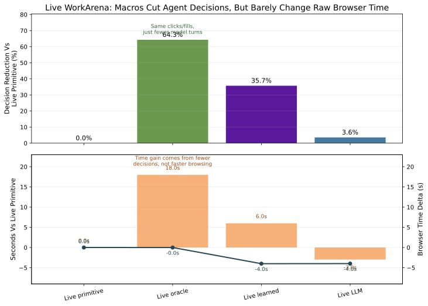
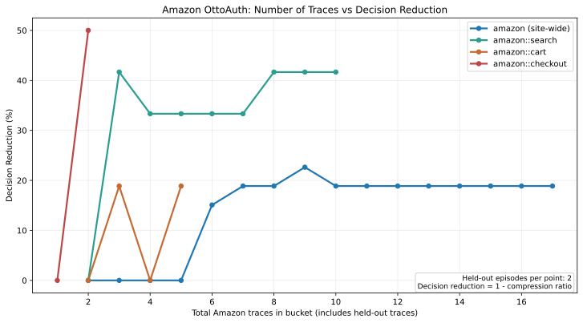
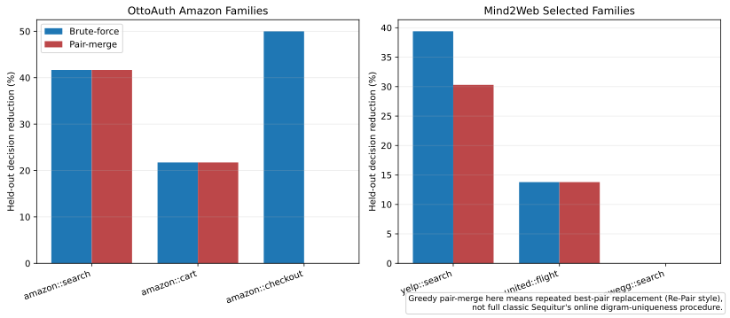

# Browser Agent Action Chunking

Date: 2026-03-30

## Question

Can we mine repeated browser-action chunks from traces, expose them as higher-level actions, and make browser agents cheaper and faster without hurting task success?

## Short Answer

Yes, but only in the right regime.

- It works well on **dense repeated workflow families**.
- It is weak on **broad heterogeneous web data**.
- The main bottleneck is now usually **coverage** or **macro selection**, not whether repeated chunks exist at all.
- The current gains are mostly **control-plane gains**:
  - fewer model decisions
  - fewer tokens
  - less planning depth
  - lower controller latency
- The gains are **not automatically browser-time gains**, because a macro still expands into the same primitive browser actions.

## Main Takeaways

1. **Broad web data is still coverage-limited.**
   On public Mind2Web, the best current setting only reaches about `3.23%` overall decision reduction.

2. **Dense repeated families compress strongly.**
   On MiniWoB, a learned live controller reaches `60.0%` decision reduction. On WorkArena service-catalog, the replay upper bound and live oracle both reach `64.29%`.

3. **Selection matters a lot.**
   No-training semantic macro choice is not enough by itself. A lightweight structural guard or learned chooser is still important.

4. **Real production-agent traces do start to yield useful macros.**
   On OttoAuth Amazon traces, `amazon.com::search` reaches `41.67%` held-out decision reduction, `amazon.com::cart` reaches `21.74%`, and site-wide `amazon.com` reaches `26.03%` under the current 20%-held-out split.

5. **The first real e-commerce macro to emerge is search-phase, not checkout-phase.**
   We see something like `amazon_search(query)` before anything like `add_to_cart()` or `checkout(address)`.

## The Four Figures That Matter

### 1. Overall Story


This is the highest-level result:

- weak on broad pooled web traces
- strong on dense repeated families
- sensitive to macro selection quality

### 2. Why Broad Web Data Stays Weak


Best current public-web setting:

- grouping: `site+task-family -> site`
- overall decision reduction: `3.23%`
- held-out-step coverage: `26.63%`

Interpretation:

- there is real redundancy
- but not enough trajectory mass falls inside promotable macro regions
- even perfect selection would not create large total savings until coverage improves

### 3. Strongest Real Benchmark Result



Current live WorkArena service-catalog numbers:

- primitive baseline:
  - `28 -> 28`
  - `100%` success
- live oracle macro controller:
  - `28 -> 10`
  - `64.29%` decision reduction
  - `100%` success
- live learned controller:
  - `28 -> 18`
  - `35.71%` decision reduction
  - `100%` success
- live no-training LLM controller:
  - `28 -> 27`
  - `3.57%` decision reduction
  - `100%` success

Interpretation:

- the compression opportunity is real
- a strong selector recovers a lot of it
- semantic names alone are not enough in a crowded action space

### 4. Real-Agent Amazon Curve



Current live OttoAuth Amazon picture:

- site-wide `amazon.com` peaks at `26.03%`
- `amazon.com::search` peaks at `41.67%`
- `amazon.com::cart` peaks at `21.74%`
- `amazon.com::checkout` shows `50%`, but on only `2` traces, so it is not meaningful yet

Interpretation:

- search macros are clearly emerging
- cart is starting to emerge
- checkout is still too data-sparse
- mixing workflow families hurts the site-wide curve

## Current Best Numbers

- **Mind2Web best hierarchy:** `3.23%` overall decision reduction
- **MiniWoB learned live controller:** `80 -> 32`, `60.0%`
- **MiniWoB no-training LLM + guard:** `80 -> 43`, `46.25%`
- **WorkArena replay/oracle:** `28 -> 10`, `64.29%`
- **WorkArena learned live controller:** `28 -> 18`, `35.71%`
- **WorkArena no-training LLM live controller:** `28 -> 27`, `3.57%`
- **OttoAuth Amazon site-wide:** `26.03%`
- **OttoAuth Amazon search:** `41.67%`
- **OttoAuth Amazon cart:** `21.74%`

## What Works

- repeated same-site workflow families
- short-to-medium macros with few arguments
- bucket-local mining such as `website_task_family`
- held-out macro promotion
- structural guards or learned selectors
- primitive fallback

## What Does Not Work Well Yet

- broad global macro vocabularies over heterogeneous traces
- relying on semantic names/descriptions alone
- expecting long monolithic e-commerce macros to emerge from sparse mixed data
- expecting macro compression to automatically reduce raw browser wall clock

## Why Long Macros Have Been Hard So Far

The issue is not that long macros are impossible. The issue is that they need:

- many repeated traces in the same workflow family
- enough abstraction to ignore argument differences
- enough consistency after the shared prefix
- enough trigger precision to be callable safely

Today, Amazon traces still diverge too much after the common search-entry prefix, so `add_to_cart()` and `checkout(address)` have not yet stabilized.

## Greedy Pair-Merge Baseline

I also compared the current brute-force chunk miner against a greedy repeated-pair-replacement baseline, which is closer to **Re-Pair** than classic online **Sequitur**.

Figure:



Current takeaway:

- on clean, strongly hierarchical buckets, pair-merge is often just as good
- on OttoAuth Amazon:
  - `amazon.com`: exact tie, `20.55%`
  - `amazon.com::search`: exact tie, `41.67%`
  - `amazon.com::cart`: exact tie, `21.74%`
- on `united::flight`: exact tie, `13.79%`
- on noisier overlapping buckets, brute force is better:
  - `yelp::search`: brute force `39.39%`, pair-merge `30.30%`

Interpretation:

- greedy pair-merge is a strong simpler baseline
- but it commits to one merge hierarchy and can miss overlapping medium-length macros that brute force can still propose and promote
- so pair-merge looks attractive for incremental online macro growth, but brute force is still the stronger offline discovery method in noisy buckets

Concrete toy example:

- suppose the useful overlapping candidates are:
  - `search(query) = A B C`
  - `open_first_result() = C D`
  - `search_then_open_first_result(query) = A B C D`
- brute force can keep all three candidates alive and let held-out replay decide which ones are worth promoting
- greedy pair-merge has to commit early:
  - if it merges `A B -> X`, the sequence becomes `X C D`
  - that makes `A B C D` easy to build as `X C D`
  - but it can crowd out or delay the overlapping `C D` view as an independent reusable tool
- browser-agent tool libraries often want overlapping callable routines, not one single best segmentation of the trace

## Minimal Algorithm

The current minimal algorithm that best matches the evidence is:

1. Collect primitive browser traces.
2. Canonicalize them into `dataflow_coarse`.
3. Bucket traces by `website` or `website_task_family`.
4. Mine repeated contiguous chunks.
5. Promote only chunks that survive held-out replay.
6. Expose promoted chunks as named macros alongside primitive actions.
7. Use a structural guard or learned chooser to select between macros and primitives.
8. Always keep primitive fallback.

## Current Bottlenecks

1. **Coverage**
   Broad web traces still do not provide enough repeated same-family mass.

2. **Selection quality**
   On dense action spaces, the controller still has to know exactly when a macro is valid.

3. **Collection consistency**
   Real-agent traces help only when the agent solves similar tasks in similar ways.

4. **Browser-side execution cost**
   Macros reduce decisions, but not browser actions, unless the runtime itself becomes cheaper.

## Recommendation

If the goal is a deployable browser-agent efficiency layer, the best current recipe is:

- collect traces on repeated workflow families
- mine macros locally within those families
- promote only held-out-useful macros
- expose them as named actions
- gate them with a cheap structural mask or learned selector
- keep primitive fallback

That already looks promising on MiniWoB, WorkArena, and early Amazon live-agent traces.

## Reproduction

### Fastest Amazon Reproduction

```bash
git clone https://github.com/Clamepending/toolcalltokenization.git
cd toolcalltokenization
git checkout c8d3a93

python3 -m pip install -U huggingface_hub
python3 - <<'PY'
from huggingface_hub import snapshot_download
snapshot_download(
    repo_id="clamepending/ottoauth-local-agent-snapshot",
    repo_type="dataset",
    local_dir="hf_datasets/ottoauth_local_agent_snapshot",
    local_dir_use_symlinks=False,
)
PY

python3 scripts/run_ottoauth_amazon_study.py \
  --input hf_datasets/ottoauth_local_agent_snapshot/processed/canonical_trace.jsonl \
  --output /tmp/ottoauth_amazon_study.json

python3 scripts/generate_ottoauth_amazon_compression_figure.py \
  --input /tmp/ottoauth_amazon_study.json \
  --output /tmp/ottoauth_amazon_compression_vs_traces.svg
```

### Dataset

- HF dataset:
  [clamepending/ottoauth-local-agent-snapshot](https://huggingface.co/datasets/clamepending/ottoauth-local-agent-snapshot)

### OttoAuth Collection

The README now contains the step-by-step OttoAuth extension collection flow, including:

- starting the OttoAuth server
- building and refreshing the extension
- enabling recording
- selecting the trace folder
- starting polling
- queueing campaigns
- ingesting collected traces
